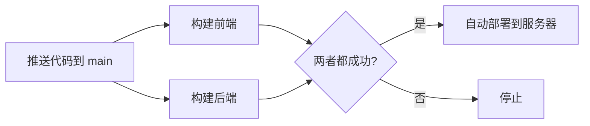

# CI/CD 自动部署配置更新

## 📋 更新内容

### 之前的问题

旧的配置使用了分离的 CI 和 Deploy workflows：
- `ci.yml` - 负责构建检查
- `deploy.yml` - 负责部署（使用 `workflow_run` 触发）

**问题**：`workflow_run` 触发器不可靠，导致即使 CI 成功，部署也不会自动执行。

### 新的配置

现在合并为单一 workflow：`ci.yml` → **Build and Deploy**

#### 工作流程



#### 特性

✅ **自动触发**：
- 推送到 `main` 分支时自动运行
- Pull Request 时只运行构建检查（不部署）

✅ **手动触发**：
- 可以在 GitHub Actions 页面手动点击 "Run workflow" 触发部署

✅ **可靠性**：
- 使用 `needs` 明确依赖关系
- 只有前后端构建都成功才会部署
- 避免了 `workflow_run` 的不稳定性

## 🚀 使用方法

### 自动部署

```bash
# 本地修改代码
git add .
git commit -m "feat: 添加新功能"
git push origin main

# GitHub Actions 会自动：
# 1. 构建前端 ✓
# 2. 构建后端 ✓
# 3. SSH 到服务器执行 deploy.sh ✓
```

### 手动触发

1. 访问：https://github.com/hyperlanecc/web/actions
2. 选择 "Build and Deploy" workflow
3. 点击 "Run workflow" 按钮
4. 选择 `main` 分支
5. 点击绿色的 "Run workflow" 按钮

## 📝 前置条件

确保在 GitHub 仓库配置了以下 Secrets：

访问：`https://github.com/hyperlanecc/web/settings/secrets/actions`

需要的 Secrets：
- **SERVER_HOST**: 服务器 IP 地址
- **SERVER_SSH_KEY**: SSH 私钥（完整内容，包括 BEGIN 和 END 行）

## 🔍 监控部署

### 查看 GitHub Actions 日志

1. 访问 Actions 页面
2. 点击最新的 workflow run
3. 查看每个 job 的详细日志

### 查看服务器部署日志

```bash
# SSH 登录服务器
ssh root@你的服务器IP

# 查看部署日志
tail -f /var/log/hyperlane-deploy.log

# 查看服务状态
pm2 status
systemctl status hyperlane-server
```

## 🎯 工作流程详解

### Job 1: frontend-build
- 使用 Node.js 20
- 使用 pnpm 8
- 安装依赖并构建 Next.js 项目

### Job 2: backend-build
- 使用 Go 1.23
- 拉取子模块
- 构建 Go 后端服务

### Job 3: deploy
- **依赖**：需要前两个 job 都成功
- **条件**：只在 push 到 main 或手动触发时运行（PR 不运行）
- **操作**：SSH 到服务器执行部署脚本

## 🛠️ deploy.sh 脚本

部署脚本会自动：
1. 拉取最新代码
2. 更新子模块
3. 安装前端依赖
4. 构建前端
5. 编译后端
6. 重启所有服务

## ⚠️ 注意事项

1. **环境变量**：`.env` 文件不会自动同步（因为包含敏感信息），需要手动在服务器上配置
2. **分支保护**：建议在 GitHub 设置中启用分支保护，避免直接推送到 main
3. **回滚**：如果部署失败，脚本会自动回滚（由 deploy.sh 处理）

## 📚 相关文档

- [完整部署教程](./deploy.md)
- [部署配置详解](./deployment.md)
- [域名配置](./domain.md)

---

更新时间：2025-11-17