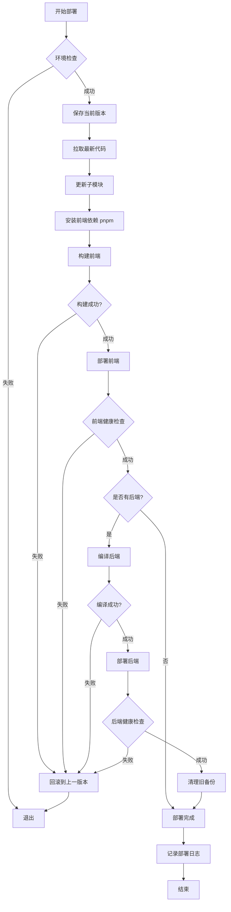

# 🚀 Hyperlane 项目部署脚本改进方案

## 📋 当前脚本问题分析

### 现有 deploy.sh 的问题

1. **使用 npm 而非 pnpm**
   - 第 45 行：`npm ci --production=false`
   - 第 48 行：`npm run build`
   - 第 67 行：`pm2 start npm --name frontend -- start`

2. **缺少 Git 仓库配置**
   - 没有指定远程仓库 URL
   - 无法从零开始克隆项目

3. **缺少健康检查**
   - 部署后没有验证服务是否正常运行
   - 没有检查端口是否可访问

4. **缺少回滚机制**
   - 部署失败时无法自动回滚到上一个版本
   - 没有保存部署历史

5. **错误处理不完善**
   - 某些步骤失败后继续执行
   - 没有详细的错误信息

6. **缺少环境检查**
   - 没有检查必要的工具是否安装（pnpm、go、pm2 等）
   - 没有检查环境变量是否配置

## 🎯 改进方案设计

### 核心功能

1. **完整的 Git 集成**
   - 支持从远程仓库拉取代码
   - 支持子模块更新
   - 记录部署版本（commit hash）

2. **使用 pnpm**
   - 更快的安装速度
   - 更少的磁盘占用
   - 更严格的依赖管理

3. **健康检查机制**
   - 前端服务健康检查（HTTP 请求）
   - 后端服务健康检查（API 端点）
   - 超时和重试机制

4. **自动回滚**
   - 保存上一个成功的部署版本
   - 部署失败时自动回滚
   - 手动回滚命令支持

5. **完善的日志**
   - 彩色输出，易于阅读
   - 详细的时间戳
   - 错误堆栈跟踪

6. **环境检查**
   - 检查必要工具是否安装
   - 验证配置文件是否存在
   - 检查端口是否被占用

### 部署流程图



## 📝 改进后的脚本功能清单

### 1. 配置管理
- [x] Git 仓库 URL 配置
- [x] 分支配置（默认 main）
- [x] 部署目录配置
- [x] 日志文件配置
- [x] 备份保留数量配置

### 2. 环境检查
- [x] 检查 pnpm 是否安装
- [x] 检查 go 是否安装
- [x] 检查 pm2 是否安装
- [x] 检查 systemctl 是否可用
- [x] 检查必要端口是否可用

### 3. Git 操作
- [x] 克隆仓库（首次部署）
- [x] 拉取最新代码
- [x] 更新子模块
- [x] 记录 commit hash
- [x] 支持指定分支/tag

### 4. 前端部署
- [x] 使用 pnpm 安装依赖
- [x] 使用 pnpm build 构建
- [x] 使用 pm2 管理进程
- [x] 零停机重载（pm2 reload）
- [x] 健康检查（HTTP 请求）

### 5. 后端部署
- [x] Go 依赖下载
- [x] Go 编译优化
- [x] 二进制文件备份
- [x] systemd 服务重启
- [x] 健康检查（API 请求）

### 6. 回滚机制
- [x] 保存上一个成功版本
- [x] 自动回滚（部署失败时）
- [x] 手动回滚命令
- [x] 回滚后验证

### 7. 日志和通知
- [x] 彩色日志输出
- [x] 详细的时间戳
- [x] 错误堆栈跟踪
- [x] 部署摘要报告

### 8. 清理和维护
- [x] 清理临时文件
- [x] 清理旧备份
- [x] 清理旧日志
- [x] 磁盘空间检查

## 🔧 脚本使用方法

### 基本用法

```bash
# 标准部署
./deploy.sh

# 部署指定分支
./deploy.sh --branch develop

# 部署指定 tag
./deploy.sh --tag v1.0.0

# 跳过健康检查（不推荐）
./deploy.sh --skip-health-check

# 仅部署前端
./deploy.sh --frontend-only

# 仅部署后端
./deploy.sh --backend-only

# 回滚到上一个版本
./deploy.sh --rollback

# 查看部署历史
./deploy.sh --history

# 查看帮助
./deploy.sh --help
```

### 首次部署

```bash
# 1. 确保服务器已安装必要工具
# 2. 创建部署目录
mkdir -p /root/app/hyperlane.cc

# 3. 下载部署脚本
cd /root/app/hyperlane.cc
curl -O https://raw.githubusercontent.com/hyperlane/web/main/deploy.sh
chmod +x deploy.sh

# 4. 编辑配置（如果需要）
nano deploy.sh
# 修改 GIT_REPO、BASE_DIR 等配置

# 5. 执行首次部署
./deploy.sh
```

### CI/CD 集成

虽然当前是手动执行，但脚本设计支持未来集成到 CI/CD：

```yaml
# GitHub Actions 示例（未来可用）
name: Deploy to Production
on:
  push:
    branches: [main]
jobs:
  deploy:
    runs-on: ubuntu-latest
    steps:
      - name: Deploy to server
        uses: appleboy/ssh-action@master
        with:
          host: ${{ secrets.SERVER_HOST }}
          username: root
          key: ${{ secrets.SSH_PRIVATE_KEY }}
          script: |
            cd /root/app/hyperlane.cc
            ./deploy.sh
```

## 📊 部署监控

### 日志位置

```bash
# 部署日志
/var/log/hyperlane-deploy.log

# 前端日志
pm2 logs frontend

# 后端日志
journalctl -u hyperlane-server -f

# Nginx 日志
/var/log/nginx/access.log
/var/log/nginx/error.log
```

### 健康检查端点

```bash
# 前端健康检查
curl http://localhost:3000

# 后端健康检查
curl http://localhost:8080/api/health
# 或
curl http://localhost:8080/api/ping
```

## 🔒 安全建议

1. **限制脚本权限**
   ```bash
   chmod 700 deploy.sh
   chown root:root deploy.sh
   ```

2. **使用 SSH Key 而非密码**
   - 已在脚本中使用 SSH 克隆

3. **环境变量保护**
   - 敏感信息不要硬编码
   - 使用 `.env` 文件
   - `.env` 文件不要提交到 Git

4. **日志轮转**
   ```bash
   # 配置 logrotate
   cat > /etc/logrotate.d/hyperlane << EOF
   /var/log/hyperlane-deploy.log {
       daily
       rotate 7
       compress
       delaycompress
       missingok
       notifempty
   }
   EOF
   ```

## 🎯 下一步行动

1. **切换到 Code 模式**实施以下修改：
   - 创建新的 `deploy.sh` 脚本
   - 更新 `deploy.md` 文档
   - 创建 `.env.example` 补充说明

2. **测试部署流程**：
   - 在测试环境验证
   - 验证回滚机制
   - 验证健康检查

3. **文档完善**：
   - 更新部署教程
   - 添加故障排查指南
   - 添加性能优化建议

## 📚 参考资源

- [pnpm 官方文档](https://pnpm.io/)
- [PM2 官方文档](https://pm2.keymetrics.io/)
- [Next.js 部署指南](https://nextjs.org/docs/deployment)
- [Go 编译优化](https://golang.org/doc/install/source#environment)
- [systemd 服务管理](https://www.freedesktop.org/software/systemd/man/systemd.service.html)