# 🚀 Hyperlane 项目完整部署教程

## 📋 目录

1. [准备服务器](#1-准备服务器)
2. [安装基础环境](#2-安装基础环境)
3. [配置 GitHub](#3-配置-github)
4. [克隆项目代码](#4-克隆项目代码)
5. [配置前端环境变量](#5-配置前端环境变量)
6. [配置后端](#6-配置后端)
7. [构建和启动服务](#7-构建和启动服务)
8. [配置 Nginx](#8-配置-nginx)
9. [配置 SSL (HTTPS)](#9-配置-ssl-https)
10. [日常更新流程](#10-日常更新流程)

---

## 1. 准备服务器

### 1.1 购买云服务器

选择任意云服务商:
- **阿里云**: https://www.aliyun.com/
- **腾讯云**: https://cloud.tencent.com/
- **AWS**: https://aws.amazon.com/
- **Vultr**: https://www.vultr.com/

### 1.2 推荐配置

- **CPU**: 2核或以上
- **内存**: 4GB 或以上
- **硬盘**: 40GB SSD
- **系统**: Ubuntu 22.04 或 Debian 12
- **带宽**: 5Mbps 或以上

### 1.3 获取服务器信息

购买后记录:
- **IP地址**: 例如 `172.237.71.71`
- **SSH端口**: 默认 `22`
- **登录用户**: 通常是 `root`
- **登录密码**: 设置的初始密码

### 1.4 SSH 登录服务器

```bash
# 在你的电脑上打开终端 (Mac/Linux) 或 PowerShell (Windows)
ssh root@你的服务器IP

# 首次连接会提示是否信任,输入 yes
# 然后输入密码
```

---

## 2. 安装基础环境

### 2.1 一键安装脚本

**复制以下整个代码块,粘贴到服务器终端执行:**

```bash
cat > /tmp/install_all.sh << 'EOF'
#!/bin/bash
set -e

echo "━━━━━━━━━━━━━━━━━━━━━━━━━━━━━━━━━━"
echo "  🚀 Hyperlane 项目环境安装"
echo "━━━━━━━━━━━━━━━━━━━━━━━━━━━━━━━━━━"
echo ""

# 1. 更新系统
echo "⏳ [1/7] 更新系统..."
apt update && apt upgrade -y

# 2. 安装基础工具
echo "⏳ [2/7] 安装基础工具..."
apt install -y curl git build-essential wget nano

# 3. 安装 Node.js 20 (LTS)
echo "⏳ [3/7] 安装 Node.js 20..."
curl -fsSL https://deb.nodesource.com/setup_20.x | bash -
apt install -y nodejs

# 4. 安装 pnpm
echo "⏳ [4/7] 安装 pnpm..."
if pnpm -v &>/dev/null; then
    echo "   ✓ pnpm 已存在"
else
    npm install -g pnpm --force
fi

# 5. 安装 PM2
echo "⏳ [5/7] 安装 PM2..."
pnpm install -g pm2

# 6. 安装 Go 1.23.4
echo "⏳ [6/7] 安装 Go 1.23.4..."
cd /tmp
wget -q https://go.dev/dl/go1.23.4.linux-amd64.tar.gz
rm -rf /usr/local/go
tar -C /usr/local -xzf go1.23.4.linux-amd64.tar.gz
if ! grep -q '/usr/local/go/bin' ~/.bashrc; then
    echo 'export PATH=$PATH:/usr/local/go/bin' >> ~/.bashrc
fi

# 7. 安装 Nginx
echo "⏳ [7/7] 安装 Nginx..."
apt install -y nginx

# 加载环境变量
source ~/.bashrc

echo ""
echo "━━━━━━━━━━━━━━━━━━━━━━━━━━━━━━━━━━"
echo "  ✅ 环境安装完成!"
echo "━━━━━━━━━━━━━━━━━━━━━━━━━━━━━━━━━━"
echo ""
echo "Node.js:  $(node -v)"
echo "npm:      $(npm -v)"
echo "pnpm:     $(pnpm -v)"
echo "PM2:      $(pm2 -v)"
echo "Go:       $(go version 2>&1 || echo '请重新登录后生效')"
echo "Git:      $(git --version)"
echo "Nginx:    $(nginx -v 2>&1)"
echo ""
echo "💡 请运行以下命令使环境变量生效:"
echo "   source ~/.bashrc"
echo ""
EOF

# 执行安装
bash /tmp/install_all.sh
```

### 2.2 加载环境变量

```bash
source ~/.bashrc
```

### 2.3 验证安装

```bash
# 验证所有工具
node -v   # v20.x.x
pnpm -v   # 8.x.x
pm2 -v    # 5.x.x
go version # go1.23.4
nginx -v  # nginx/1.x.x
```

---

## 3. 配置 GitHub

### 3.1 生成 SSH Key

```bash
# 生成 SSH 密钥对
ssh-keygen -t ed25519 -C "你的邮箱@example.com"

# 提示 "Enter file in which to save the key": 直接按回车
# 提示 "Enter passphrase": 直接按回车 (不设密码)
# 提示 "Enter same passphrase again": 直接按回车
```

### 3.2 查看并复制公钥

```bash
cat ~/.ssh/id_ed25519.pub
```

**完整复制输出** (从 `ssh-ed25519` 开始到邮箱结束)

### 3.3 添加到 GitHub

1. 打开浏览器访问: **https://github.com/settings/ssh/new**
2. **Title**: 填 `hyperlane-server`
3. **Key**: 粘贴刚才复制的公钥
4. 点击 **Add SSH key**

### 3.4 测试连接

```bash
ssh -T git@github.com
```

看到 `Hi 你的用户名! You've successfully authenticated` 就成功了!

### 3.5 创建 GitHub OAuth App (用于用户登录)

1. 访问: **https://github.com/settings/developers**
2. 点击 **OAuth Apps** → **New OAuth App**
3. 填写信息:
   - **Application name**: `Hyperlane CC`
   - **Homepage URL**: `https://你的域名` (暂时可填 `http://你的服务器IP`)
   - **Authorization callback URL**: `https://你的服务器IP/api/auth/callback`
4. 点击 **Register application**
5. **记录下来**: 
   - **Client ID**: 例如 `Iv1.abc123def456`
   - **Client Secret**: 点击 **Generate a new client secret** 生成,**立即复制保存!**

---

## 4. 克隆项目代码

### 4.1 创建项目目录

```bash
mkdir -p /root/app/hyperlane.cc
cd /root/app/hyperlane.cc
```

### 4.2 克隆代码 (包含子模块)

```bash
# 替换你的 GitHub 用户名和仓库名
git clone --recurse-submodules git@github.com:你的用户名/你的仓库名.git .
```

### 4.3 验证克隆

```bash
# 检查文件
ls -la

# 应该看到:
# - package.json
# - src/
# - deploy.sh
# - server/  (子模块)
# 等等

# 检查子模块
ls -la server/
# 应该能看到后端代码
```

---

## 5. 配置前端环境变量

### 5.1 创建 .env 文件

```bash
cd /root/app/hyperlane.cc
cp .env.example .env
```

### 5.2 编辑 .env

```bash
nano .env
```

### 5.3 填入配置

**完整的 `.env` 文件内容**:

```bash
# ============= 后端 API 地址 =============
# 填你的服务器IP或域名
NEXT_PUBLIC_API_URL=https://你的服务器IP

# ============= GitHub OAuth 登录 =============
# Client ID: 从 GitHub OAuth App 获取
# redirect_uri: 必须与 GitHub OAuth App 中配置的一致
NEXT_PUBLIC_OAUTH=https://github.com/login/oauth/authorize?client_id=你的CLIENT_ID&redirect_uri=https://你的服务器IP/api/auth/callback&scope=read:user,user:email

# ============= NextAuth 配置 =============
# 你的网站地址 (有域名填域名,没有填服务器IP)
NEXTAUTH_URL=https://你的域名或服务器IP

# 生成随机密钥 (下面的命令会生成一个)
# 运行: openssl rand -base64 32
NEXTAUTH_SECRET=你生成的随机密钥

# ============= Cloudinary 图片上传 (可选) =============
# 如果不需要图片上传功能,可以留空
NEXT_PUBLIC_CLOUDINARY_CLOUD_NAME=
NEXT_PUBLIC_CLOUDINARY_API_KEY=
NEXT_PUBLIC_CLOUDINARY_API_SECRET=
NEXT_PUBLIC_CLOUDINARY_UPLOAD_FOLDERS=

# ============= Google Analytics (可选) =============
# 如果不需要分析功能,可以留空
NEXT_PUBLIC_GA_ID=
GOOGLE_SERVICE_ACCOUNT_KEY=
GA_VIEW_ID=
GA4_PROPERTY_ID=
```

### 5.4 生成 NEXTAUTH_SECRET

**在另一个终端窗口执行**:

```bash
openssl rand -base64 32
```

复制输出,填入 `.env` 的 `NEXTAUTH_SECRET=` 后面

### 5.5 保存并退出

1. 按 `Ctrl + X`
2. 按 `Y` (保存)
3. 按 `Enter` (确认)

---

## 6. 配置后端

### 6.1 创建配置文件

```bash
nano /root/app/hyperlane.cc/server/config.yml
```

### 6.2 填入配置

```yaml
oauth:
  provider: github
  # 从 GitHub OAuth App 获取
  clientId: 你的GitHub_CLIENT_ID
  clientSecret: 你的GitHub_CLIENT_SECRET
  # 以下地址固定不变
  accessApi: https://github.com/login/oauth/access_token
  getUser: https://api.github.com/user
  # 回调地址 (必须与 GitHub OAuth App 和前端 .env 中的一致)
  redirectUri: https://你的服务器IP/api/auth/callback
  # 前端地址
  frontendUri: https://你的域名或服务器IP
```

### 6.3 保存并退出

```
Ctrl + X → Y → Enter
```

---

## 7. 构建和启动服务

### 7.1 安装前端依赖

```bash
cd /root/app/hyperlane.cc
pnpm install
```

### 7.2 构建前端

```bash
pnpm run build
```

### 7.3 启动前端服务

```bash
# 用 PM2 启动 Next.js
pm2 start pnpm --name frontend -- start

# 保存 PM2 配置
pm2 save

# 设置开机自启
pm2 startup
# 会输出一条命令,复制并执行它

# 查看状态
pm2 status
# 应该显示 frontend | online

# 查看日志
pm2 logs frontend
```

### 7.4 编译后端

```bash
# 进入后端目录
cd /root/app/hyperlane.cc/server

# 下载 Go 依赖
go mod download

# 编译二进制文件
go build -o app -v .

# 赋予执行权限
chmod +x app

# 测试运行 (Ctrl+C 停止)
./app
```

### 7.5 配置后端 systemd 服务

```bash
# 创建服务文件
nano /etc/systemd/system/hyperlane-server.service
```

**填入**:

```ini
[Unit]
Description=Hyperlane Backend Server
After=network.target

[Service]
Type=simple
User=root
WorkingDirectory=/root/app/hyperlane.cc/server
ExecStart=/root/app/hyperlane.cc/server/app
Restart=always
RestartSec=10
StandardOutput=journal
StandardError=journal

[Install]
WantedBy=multi-user.target
```

**保存**: `Ctrl+X → Y → Enter`

### 7.6 启动后端服务

```bash
# 重载 systemd 配置
systemctl daemon-reload

# 启动后端
systemctl start hyperlane-server

# 设置开机自启
systemctl enable hyperlane-server

# 查看状态
systemctl status hyperlane-server
# 应该显示 active (running)

# 查看日志
journalctl -u hyperlane-server -f
# Ctrl+C 停止查看日志
```

---

## 8. 配置 Nginx

### 8.1 创建 Nginx 配置

```bash
nano /etc/nginx/sites-available/hyperlane
```

### 8.2 填入配置

**基础 HTTP 配置** (先测试,后面再配置 HTTPS):

```nginx
# 前端站点
server {
    listen 80;
    server_name 你的域名或服务器IP;
    
    # Next.js 前端
    location / {
        proxy_pass http://localhost:3000;
        proxy_http_version 1.1;
        proxy_set_header Upgrade $http_upgrade;
        proxy_set_header Connection 'upgrade';
        proxy_set_header Host $host;
        proxy_set_header X-Real-IP $remote_addr;
        proxy_set_header X-Forwarded-For $proxy_add_x_forwarded_for;
        proxy_set_header X-Forwarded-Proto $scheme;
        proxy_cache_bypass $http_upgrade;
    }
    
    # 后端 API
    location /api/ {
        proxy_pass http://localhost:8080;
        proxy_http_version 1.1;
        proxy_set_header Host $host;
        proxy_set_header X-Real-IP $remote_addr;
        proxy_set_header X-Forwarded-For $proxy_add_x_forwarded_for;
        proxy_set_header X-Forwarded-Proto $scheme;
    }
}
```

**保存**: `Ctrl+X → Y → Enter`

### 8.3 激活配置

```bash
# 创建软链接
ln -s /etc/nginx/sites-available/hyperlane /etc/nginx/sites-enabled/

# 删除默认配置 (可选)
rm -f /etc/nginx/sites-enabled/default

# 测试配置
nginx -t
# 应该显示: syntax is ok

# 重启 Nginx
systemctl restart nginx

# 查看状态
systemctl status nginx
# 应该显示 active (running)
```

### 8.4 测试访问

**打开浏览器访问**: `http://你的服务器IP`

应该能看到网站首页!

---

## 9. 配置 SSL (HTTPS)

### 9.1 安装 Certbot

```bash
apt install -y certbot python3-certbot-nginx
```

### 9.2 申请 SSL 证书

**前提**: 你必须有域名,并且已经解析到服务器IP

```bash
# 自动申请并配置 SSL
certbot --nginx -d 你的域名

# 例如:
# certbot --nginx -d hyperlane.cc -d www.hyperlane.cc

# 按提示:
# 1. 输入邮箱
# 2. 同意服务条款 (A)
# 3. 是否接收邮件 (Y/N)
# 4. 选择是否重定向到 HTTPS (推荐选 2)
```

### 9.3 自动续期

```bash
# 测试续期
certbot renew --dry-run

# Certbot 会自动配置定时任务,证书到期前自动续期
```

### 9.4 更新环境变量

**修改 `.env`**:

```bash
nano /root/app/hyperlane.cc/.env
```

把所有 `http://` 改为 `https://`:

```bash
NEXT_PUBLIC_API_URL=https://你的域名
NEXT_PUBLIC_OAUTH=https://github.com/login/oauth/authorize?client_id=...&redirect_uri=https://你的域名/api/auth/callback...
NEXTAUTH_URL=https://你的域名
```

**修改 `server/config.yml`**:

```bash
nano /root/app/hyperlane.cc/server/config.yml
```

```yaml
oauth:
  redirectUri: https://你的域名/api/auth/callback
  frontendUri: https://你的域名
```

### 9.5 更新 GitHub OAuth App

访问: **https://github.com/settings/developers**

修改你的 OAuth App:
- **Homepage URL**: `https://你的域名`
- **Authorization callback URL**: `https://你的域名/api/auth/callback`

### 9.6 重启服务

```bash
# 重新构建前端
cd /root/app/hyperlane.cc
pnpm run build

# 重启前端
pm2 restart frontend

# 重启后端
systemctl restart hyperlane-server

# 重启 Nginx
systemctl restart nginx
```

### 9.7 测试 HTTPS

**打开浏览器访问**: `https://你的域名`

应该能看到安全锁标志!

---

## 10. 日常更新流程

### 10.1 自动部署脚本

**每次代码更新后**,只需在服务器执行:

```bash
cd /root/app/hyperlane.cc
./deploy.sh
```

脚本会自动:
1. 拉取最新代码
2. 更新子模块
3. 安装依赖
4. 构建前端
5. 编译后端
6. 重启所有服务

### 10.2 查看日志

```bash
# 前端日志
pm2 logs frontend

# 后端日志
journalctl -u hyperlane-server -f

# Nginx 日志
tail -f /var/log/nginx/access.log
tail -f /var/log/nginx/error.log

# 部署日志
tail -f /var/log/hyperlane-deploy.log
```

### 10.3 服务管理命令

```bash
# PM2 (前端)
pm2 status           # 查看状态
pm2 restart frontend # 重启
pm2 stop frontend    # 停止
pm2 logs frontend    # 查看日志

# Systemd (后端)
systemctl status hyperlane-server   # 查看状态
systemctl restart hyperlane-server  # 重启
systemctl stop hyperlane-server     # 停止
journalctl -u hyperlane-server -f   # 查看日志

# Nginx
systemctl status nginx   # 查看状态
systemctl restart nginx  # 重启
nginx -t                 # 测试配置
```

---

## 🎉 部署完成!

现在你的网站已经完整部署好了!

**访问地址**: 
- 网站: `https://你的域名`
- API: `https://你的域名/api/...`

**常用操作**:
- 更新代码: `./deploy.sh`
- 查看状态: `pm2 status` 和 `systemctl status hyperlane-server`
- 查看日志: `pm2 logs frontend` 和 `journalctl -u hyperlane-server -f`

**有问题?**
- 检查日志查看错误信息
- 确认所有服务都在运行
- 验证配置文件是否正确
- 检查防火墙是否开放 80 和 443 端口


---

## 11. 改进的自动化部署方案

### 11.1 新版 deploy.sh 功能特性

我们提供了一个功能完善的部署脚本，包含以下特性：

#### ✨ 核心功能
- ✅ **使用 pnpm** 替代 npm，更快更高效
- ✅ **Git 集成** 支持从远程仓库拉取代码
- ✅ **健康检查** 部署后自动验证服务状态
- ✅ **自动回滚** 部署失败时自动回滚到上一版本
- ✅ **完善日志** 彩色输出，详细的时间戳和错误信息
- ✅ **环境检查** 自动检查必要工具是否安装

#### 📋 支持的命令

```bash
# 标准部署
./deploy.sh

# 部署指定分支
./deploy.sh --branch develop

# 部署指定 tag
./deploy.sh --tag v1.0.0

# 仅部署前端
./deploy.sh --frontend-only

# 仅部署后端
./deploy.sh --backend-only

# 回滚到上一个版本
./deploy.sh --rollback

# 查看部署历史
./deploy.sh --history

# 查看帮助
./deploy.sh --help
```

### 11.2 部署流程说明

新版部署脚本的完整流程：

```mermaid
graph TD
    A[开始部署] --> B{环境检查}
    B -->|失败| Z[退出]
    B -->|成功| C[保存当前版本]
    C --> D[拉取最新代码]
    D --> E[更新子模块]
    E --> F[安装前端依赖 pnpm]
    F --> G[构建前端]
    G --> H{构建成功?}
    H -->|失败| R[回滚到上一版本]
    H -->|成功| I[部署前端]
    I --> J{前端健康检查}
    J -->|失败| R
    J -->|成功| K{是否有后端?}
    K -->|否| S[部署完成]
    K -->|是| L[编译后端]
    L --> M{编译成功?}
    M -->|失败| R
    M -->|成功| N[部署后端]
    N --> O{后端健康检查}
    O -->|失败| R
    O -->|成功| P[清理旧备份]
    P --> S
    R --> Z
    S --> T[记录部署日志]
    T --> U[结束]
```



### 11.3 首次使用新脚本

如果您是首次使用改进后的部署脚本：

```bash
# 1. 备份旧脚本
cd /root/app/hyperlane.cc
mv deploy.sh deploy.sh.old

# 2. 下载新脚本（需要先在 Code 模式中创建）
# 新脚本将包含所有改进功能

# 3. 赋予执行权限
chmod +x deploy.sh

# 4. 查看帮助了解所有选项
./deploy.sh --help

# 5. 执行首次部署
./deploy.sh
```

### 11.4 配置说明

新脚本在文件开头包含可配置项：

```bash
# Git 仓库配置
GIT_REPO="git@github.com:hyperlane/web.git"
GIT_BRANCH="main"

# 部署目录
BASE_DIR="/root/app/hyperlane.cc"

# 日志配置
LOG_FILE="/var/log/hyperlane-deploy.log"

# 备份保留数量
BACKUP_KEEP=3

# 健康检查配置
HEALTH_CHECK_TIMEOUT=30
HEALTH_CHECK_RETRIES=3
```

### 11.5 健康检查端点

脚本会自动检查以下端点：

```bash
# 前端健康检查
http://localhost:3000

# 后端健康检查（需要后端实现）
http://localhost:8080/api/health
# 或
http://localhost:8080/api/ping
```

**建议在后端添加健康检查端点**：

```go
// 在后端添加健康检查路由
router.GET("/api/health", func(c *gin.Context) {
    c.JSON(200, gin.H{
        "status": "ok",
        "timestamp": time.Now().Unix(),
    })
})
```

### 11.6 故障排查

#### 部署失败常见问题

1. **pnpm 未安装**
   ```bash
   npm install -g pnpm
   ```

2. **端口被占用**
   ```bash
   # 查看端口占用
   sudo lsof -i :3000
   sudo lsof -i :8080
   
   # 杀死进程
   sudo kill -9 $(sudo lsof -t -i:3000)
   ```

3. **Git 权限问题**
   ```bash
   # 确保 SSH key 已添加到 GitHub
   ssh -T git@github.com
   ```

4. **磁盘空间不足**
   ```bash
   # 检查磁盘空间
   df -h
   
   # 清理旧备份
   ./deploy.sh --clean-backups
   ```

### 11.7 监控和日志

#### 查看部署日志
```bash
# 实时查看部署日志
tail -f /var/log/hyperlane-deploy.log

# 查看最近的部署
./deploy.sh --history

# 查看服务状态
pm2 status
systemctl status hyperlane-server
```

#### 日志轮转配置

建议配置日志轮转避免日志文件过大：

```bash
# 创建 logrotate 配置
sudo tee /etc/logrotate.d/hyperlane << EOF
/var/log/hyperlane-deploy.log {
    daily
    rotate 7
    compress
    delaycompress
    missingok
    notifempty
    create 0644 root root
}
EOF
```

### 11.8 性能优化建议

1. **使用 pnpm 的优势**
   - 更快的安装速度（共享依赖）
   - 更少的磁盘占用
   - 更严格的依赖管理

2. **构建优化**
   ```bash
   # 在 .env.production 中设置
   NODE_ENV=production
   NEXT_TELEMETRY_DISABLED=1
   ```

3. **PM2 集群模式**（可选）
   ```bash
   # 使用多核 CPU
   pm2 start pnpm --name frontend -i max -- start
   ```

### 11.9 安全建议

1. **限制脚本权限**
   ```bash
   chmod 700 deploy.sh
   chown root:root deploy.sh
   ```

2. **使用环境变量**
   - 敏感信息不要硬编码在脚本中
   - 使用 `.env` 文件管理配置

3. **定期更新依赖**
   ```bash
   # 检查过时的依赖
   pnpm outdated
   
   # 更新依赖
   pnpm update
   ```

### 11.10 下一步

要使用改进后的部署脚本，请：

1. **切换到 Code 模式**创建新的 `deploy.sh` 文件
2. 参考 [`deploy-plan.md`](deploy-plan.md) 了解详细设计
3. 测试部署流程确保一切正常

详细的改进方案和设计文档请查看：[`deploy-plan.md`](deploy-plan.md)

祝部署顺利! 🚀