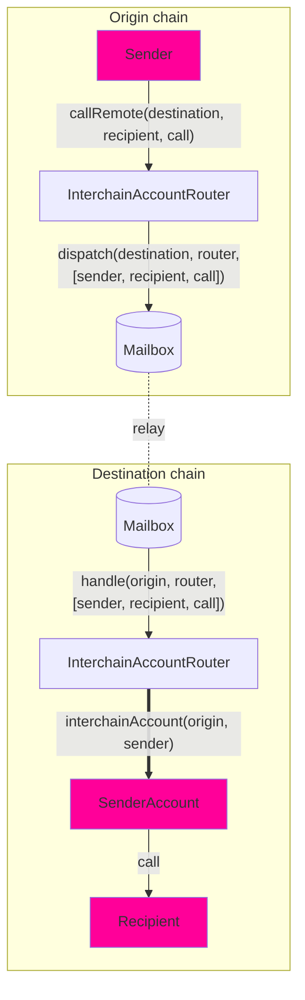

跨链账户（ICA）使源链上的合约能够对远程链上的合约进行身份验证的调用。与需要接收者实现特定接口的通用消息传递不同，ICA 允许与目标链上的_任何_合约进行交互。

开发者可以使用 ICA 进行跨链执行，使合约能够在远程链上触发函数调用。目标链上的每个 ICA 对应于源链上的唯一发送者，账户基于 `(origin, sender, router, ISM)` 是确定性的。这意味着对于每个进行跨链调用的合约，在目标链上都有一个相应的账户来执行这些调用。

ICA 目前仅在 EVM 链上受支持。

## 架构概述



## 跨链账户的工作原理

跨链账户允许您使用路由器（`InterchainAccountRouter`）从**链 A** 向**链 B** 进行远程调用。我们使用 [CREATE2](https://docs.openzeppelin.com/cli/2.8/deploying-with-create2) 来计算确定性的 [OwnableMulticall](https://github.com/hyperlane-xyz/hyperlane-monorepo/blob/main/solidity/contracts/middleware/libs/OwnableMulticall.sol) 合约地址，该合约作为您跨链调用的代理。您可以在[这里](./example-usage)探索这一点。

工作原理如下：

- 您可以编码您的调用，包括目标地址、调用数据和每个调用的 `msg.value`，批量组合在一个数组中。
- 您将编码的调用发送到**链 A** 路由器，该路由器将其中继到**链 B** 路由器。
- 解码调用后，**链 B** 路由器检查计算的地址是否已部署。如果没有，我们部署 _OwnableMulticall_ 合约。
- 然后路由器在 ICA 地址上执行多重调用，该地址反过来在**链 B** 上进行所需的任意调用。

跨链账户接口为每个 `(uint32 origin, address owner, address remoteRouter, address remoteISM)` 元组分配一个唯一的 ICA 地址。发送者拥有目标链上的该 ICA，并可以通过 `InterchainAccountRouter.callRemote()` 端点指导其进行任意函数调用。

对于 Hyperlane 支持的核心链，您可以使用路由器合约所有者设置的默认值。请参见 [#overrides](./overrides) 部分了解如何调用_任何_链。

## 接口

```solidity
// SPDX-License-Identifier: MIT OR Apache-2.0
pragma solidity >=0.6.11;

import {CallLib} from "../contracts/libs/Call.sol";

interface IInterchainAccountRouter {
    function callRemote(
        uint32 _destinationDomain,
        CallLib.Call[] calldata calls
    ) external returns (bytes32);

    function getRemoteInterchainAccount(uint32 _destination, address _owner)
        external
        view
        returns (address);
}
```

<Tip>
  - 开箱即用地使用 `InterchainAccountRouter` - ICA 路由器已部署到核心链。请参考[地址](/docs/reference/addresses/deployments/interchainAccountRouter)。
  尝试使用 `callRemote` 方法通过您钱包的跨链账户进行调用。
</Tip>