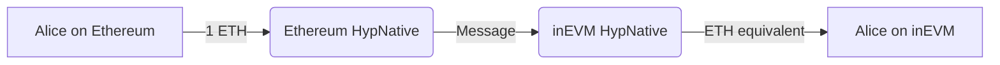
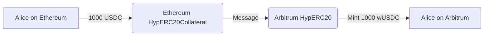

Hyperlane Warp 路由（HWR）定义了资产在链之间的移动方式，无论是作为原生代币、合成表示还是抵押品支持的资产。路由的选择取决于资产类型和目标链上的预期行为。

## HWR 组合

### 1. 原生到原生

此路由允许在都使用自己原生代币的链之间转移原生代币。

<Info>
  此类型的路由应仅在两个网络都有等值原生代币时使用，例如 inEVM 和以太坊。
</Info>

#### 设置

- 在两条链上都部署 **HypNative** 合约。

#### 示例流程

```
交易类型：原生到原生转移
从：以太坊（ETH）
到：inEVM（ETH）
数量：1 ETH
```

#### 图表



#### 用例

- Alice 想要快速从以太坊向 inEVM 转移价值。

### 2. 原生到合成

此路由在另一条链上创建原生代币的合成表示。

#### 设置

- 在原生资产存在的源链上部署 **HypNative** 合约。
- 在铸造合成代币的目标链上部署 **HypERC20** 合约。

#### 示例流程

```
交易类型：从原生代币铸造合成代币
从：Celo（CELO）
到：Optimism（wCELO）
数量：100 CELO
```

#### 图表


#### 用例

- 基于 Celo 的项目希望使其原生 CELO 代币可在 Optimism 上使用。

### 3. 抵押品到合成

此路由允许基于抵押化的 ERC20 代币创建合成代币。

#### 设置

- 在原始资产存在的源链上部署**抵押品合约（HypERC20Collateral）**。
- 在铸造资产的目标链上部署**合成合约（HypERC20）**。

#### 示例流程

```
交易类型：从抵押品代币铸造合成代币
从：以太坊（USDC - 原始资产）- 抵押品源
到：Arbitrum（wUSDC - 铸造的合成资产）- 合成目标
数量：1000 USDC
```

#### 图表



#### 用例

- Alice 想要在 Arbitrum 上使用她的 USDC，而不需要将实际的 USDC 转移到 Arbitrum 或依赖 Arbitrum 的桥接 USDC。