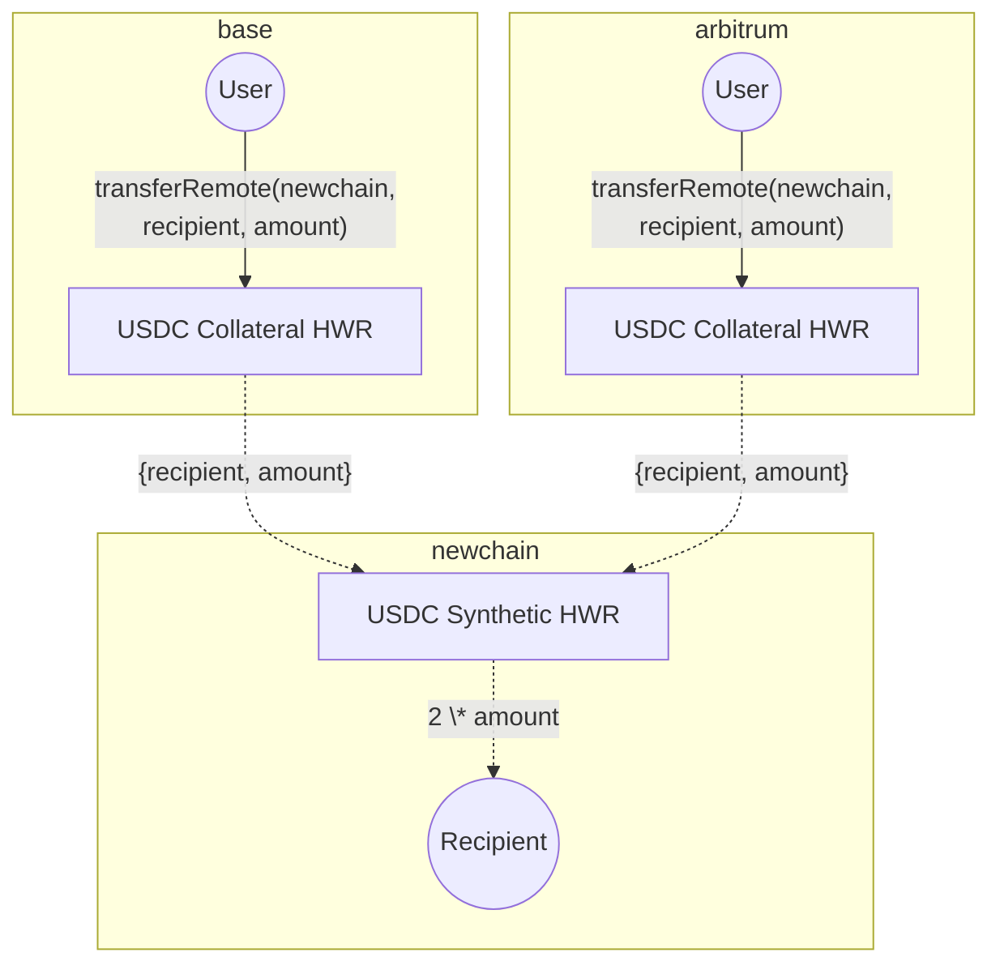

Hyperlane Warp 路由 2.0 是一种 Hyperlane Warp 路由（HWR）类型，允许从多个抵押品链获取流动性，并为支持的配置提供原生重新平衡。

## 概述

在单抵押品 HWR 中，代币被锁定在一个源链上。

示例：

- 在以太坊上锁定 100 USDC
- 在 NewChain 上铸造 100 USDC

另一方面，Hyperlane Warp 路由 2.0 允许用户从多个抵押品链进行桥接。

示例：

- 在 Base 上锁定 50 USDC
- 在 Arbitrum 上锁定 50 USDC
- 在 NewChain 上铸造 100 USDC

这种设置允许目标链从多个来源接收资产，使用户更容易载入流动性而不依赖单一源。

## 原生重新平衡

如果资金更多地向一个方向流动，路由中的一条链可能耗尽抵押品，创建不平衡的流动，阻止提取。为了维持流畅的用户体验，抵押品必须在链之间平衡。HWR 2.0 通过原生重新平衡解决了这个问题——抵押品通过重新平衡器自动在链之间移动以解决不平衡。

要了解更多关于原生重新平衡的信息，请前往：[HWR 2.0：原生重新平衡](/docs/guides/warp-routes/evm/multi-collateral-warp-routes-rebalancing)

## 高级流程图

## 支持的代币和协议

当 HWR 2.0 中每个参与链上的给定代币满足所需条件时，原生重新平衡是可能的。

### USDC

- **链**：Arbitrum、Base、以太坊、OP Mainnet、Polygon PoS、Unichain、Avalanche
  - 对 [Circle CCTP](https://developers.circle.com/cctp) v1/v2 和 Everclear 支持的其他链的支持将逐步推出。

### ETH
- **链**：Arbitrum Base、以太坊、OP Mainnet
  - 对其他链的支持将基于 Everclear 部署逐步推出

### USDT

- 🚧 原生重新平衡支持目前已计划

<Note>
原生重新平衡的链支持取决于协议可用性和代币桥接基础设施。阅读更多关于[原生重新平衡要求](/docs/guides/warp-routes/evm/multi-collateral-warp-routes-rebalancing#requirements-for-native-rebalancing)的信息
</Note>

## 指南

- 要部署 Hyperlane Warp 路由 2.0，请前往[部署 Hyperlane Warp 路由 2.0](/docs/guides/warp-routes/evm/deploy-multi-collateral-warp-routes)