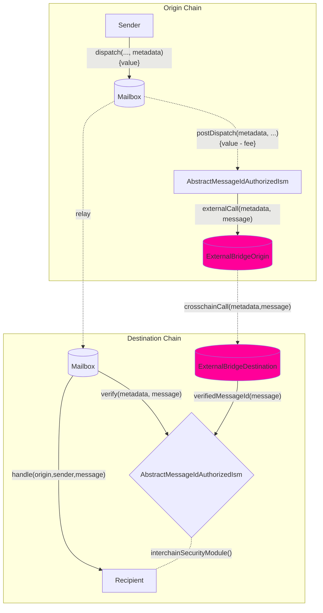

Hook 和 ISM 具有互补关系：您可以从源链自定义行为，它们在目标链上使用成对的 ISM 合约来验证您的自定义 hook 行为。

您可以根据需求实现和使用自己的 hook 和 ISM 模式。您可以通过在源链上实现 `IPostDispatchHook` 接口和在目标链上实现 `IInterchainSecurityModule` 接口来使用外部桥接提供商，例如 Wormhole 或 Chainlink 的 CCIP。

<AccordionGroup>
  <Accordion title="IPostDispatchHook 接口">
    ```solidity
        interface IPostDispatchHook {
          enum Types {
              UNUSED,
              ROUTING,
              AGGREGATION,
              MERKLE_TREE,
              INTERCHAIN_GAS_PAYMASTER,
              FALLBACK_ROUTING,
              ID_AUTH_ISM,
              PAUSABLE,
              PROTOCOL_FEE,
              LAYER_ZERO_V1,
              RATE_LIMITED,
              ARB_L2_TO_L1,
              OP_L2_TO_L1,
              MAILBOX_DEFAULT_HOOK,
              AMOUNT_ROUTING
          }

          /**
          * @notice 返回表示 hook 类型的枚举
          */
          function hookType() external view returns (uint8);

          /**
          * @notice 返回 hook 是否支持 metadata
          * @param metadata metadata
          * @return hook 是否支持 metadata
          */
          function supportsMetadata(
              bytes calldata metadata
          ) external view returns (bool);

          /**
          * @notice 通过 Mailbox 调度消息后的后置操作
          * @param metadata hook 所需的 metadata
          * @param message 从 Mailbox.dispatch() 调用传递的消息
          */
          function postDispatch(
              bytes calldata metadata,
              bytes calldata message
          ) external payable;

          /**
          * @notice 计算 postDispatch 调用所需的支付
          * @param metadata hook 所需的 metadata
          * @param message 从 Mailbox.dispatch() 调用传递的消息
          * @return postDispatch 调用的报价支付
          */
          function quoteDispatch(
              bytes calldata metadata,
              bytes calldata message
          ) external view returns (uint256);
        }
    ```

  </Accordion>

  <Accordion title="IInterchainSecurityModule 接口">
    ```solidity
    // SPDX-License-Identifier: MIT OR Apache-2.0
    pragma solidity >=0.6.11;

    interface IInterchainSecurityModule {
    enum Types {
    UNUSED,
    ROUTING,
    AGGREGATION,
    LEGACY_MULTISIG,
    MERKLE_ROOT_MULTISIG,
    MESSAGE_ID_MULTISIG,
    NULL, // used with relayer carrying no metadata
    CCIP_READ,
    ARB_L2_TO_L1,
    WEIGHTED_MERKLE_ROOT_MULTISIG,
    WEIGHTED_MESSAGE_ID_MULTISIG,
    OP_L2_TO_L1
    }

        /**
        * @notice 返回表示此 ISM 编码的安全模型类型的枚举。
        * @dev Relayer 推断如何获取和格式化 metadata。
        */
        function moduleType() external view returns (uint8);

        /**
        * @notice 定义负责根据提供的 metadata 验证跨链消息的安全模型。
        * @param _metadata Relayer 提供的链下 metadata，特定于
        * 模块编码的安全模型（例如验证器签名）
        * @param _message Hyperlane 编码的跨链消息
        * @return 如果消息已验证则返回 True
        */
        function verify(
            bytes calldata _metadata,
            bytes calldata _message
        ) external returns (bool);

    }

    interface ISpecifiesInterchainSecurityModule {
    function interchainSecurityModule()
    external
    view
    returns (IInterchainSecurityModule);
    }
    ```

  </Accordion>
</AccordionGroup>

<Note>
  Hook 当前期望 metadata 使用 [`StandardHookMetadata` 库](/docs/reference/developer-tools/libraries/hookmetadata)进行格式化。
</Note>

您还可以继承我们的 `AbstractMessageIdAuthorizedIsm`，它允许对中间的 `verifyMessageId` 函数调用进行访问控制，如果从授权的 `AbstractMessageIdAuthHook` hook 接收到，则在存储中将 messageId 设置为 true。此模式目前在 [`OpStackHook`](https://github.com/hyperlane-xyz/hyperlane-monorepo/blob/ef2ece300e71a30e8f4f59e5b26e21eea012d43b/solidity/contracts/hooks/OPStackHook.sol#L33C8-L33C8) \<> [`OpStackIsm`](https://github.com/hyperlane-xyz/hyperlane-monorepo/blob/ef2ece300e71a30e8f4f59e5b26e21eea012d43b/solidity/contracts/isms/hook/OPStackIsm.sol#L31) 模式中使用。

## 工作流程



## 接口

在实现上述接口后，您可以通过在我们的 mailbox 中使用重载的 `dispatch` 调用来覆盖默认 hook 以及 hook metadata。

**在源链上：**

- `mailbox.dispatch()` 通过 `AbstractMessageIdAuthHook.postDispatch()` 调用您的自定义 hook。
- `_postDispatch` 检查 `latestDispatchedId` 是否是从 hook 调度的 id，以确保 mailbox 是调用 hook 的合约（因为调用 `postDispatch` 没有访问控制）
- `_sendMessageId` 调用您的自定义外部桥接逻辑，例如调用 CCIP router 合约。

**在目标链上：**

- 外部桥接将调用 `verifyMessageId` 函数（该函数有访问控制）并在 `verifiedMessages` 映射中将 `messageId` 设置为 true。
- 在接收到 relayer 的消息时，mailbox 将调用您的 ISM 合约（在您的接收者地址中指定），它检查 `verifiedMessages` 映射中的 messageId 是否为 true，并向 mailbox 返回 true，反之亦然。

<Warning>
  `AbstractMessageIdAuthorizedIsm` 可以通过 `postDispatch` 调用发送 `msg.value`，我们使用 `verifiedMessages` 的小端序 255 位来存储 `msg.value`，最高位用于 messageId 传递的实际接收。因此，您可以从源链发送最多 2^255 数量的原生代币价值，而目标 ISM 只能在目标链上接收最多 2^255 数量的原生代币价值。
</Warning>

## 访问控制

如果 `postDispatch` 必须只使用_刚刚_调度的 `message` 调用，则可以使用 Mailbox 上的 `latestDispatchedId` 函数来验证消息是否_确实_已调度。

<Note>
  这是用来代替某些 `require(mailbox == msg.sender)` 来支持**组合**，其中一个 hook 可能将 `message` 传递给另一个 hook。
</Note>

为方便起见，[`MailboxClient` 库](/docs/reference/developer-tools/libraries/mailbox-client)中提供了以下实用程序。