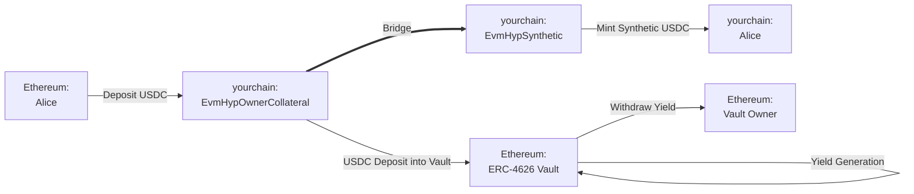
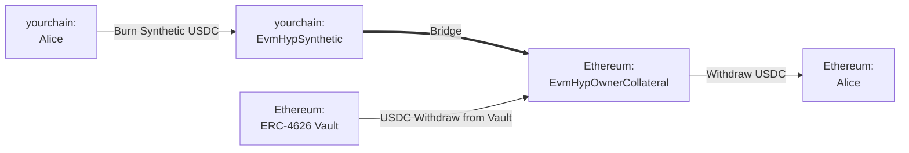

本指南的目标是说明如何使用 Hyperlane Warp Routes (HWR) 创建收益生成桥接器，确保闲置的桥接资产通过随时间复合收益而保持生产力。根据变体（下面有更多详细信息），收益分配给收益路由所有者或用户。

## 前置条件

要完成以下操作步骤，您应该具备以下条件：

1. 您选择的源网络和目标网络，您希望在它们之间部署收益路由。
2. 源网络上 [ERC-4626 vault (保险库)](https://ethereum.org/en/developers/docs/standards/tokens/erc-4626/) 的地址，您希望从中生成收益。此保险库的底层资产将被设置为 HWR 的抵押品（例如，如果保险库由 USDC 资助，HWR 也将支持 USDC 转账）。
3. 已安装的 [Hyperlane CLI](https://docs.hyperlane.xyz/docs/reference/developer-tools/cli) 实例和设置为 `HYP_KEY` 环境变量的钱包私钥，在您的源网络和目标网络上有资金。

## 操作步骤

### 概念

- **ERC-4626 Vault (保险库)**：代币化收益保险库的 Ethereum 标准。存款时，将铸造代表底层资产所有权的份额代币。
- **Yield Route (收益路由) (EvmHypOwnerCollateral & EvmHypSynthetic)**：收益型 EVM 抵押代币的 Hyperlane 表示。请注意，收益路由的保险库存入资产地址用作 HWRs 抵押代币。
  - 这种特定的收益路由变体将保险库收益分配给**所有者**。还有一种替代设置，其中收益分配给用户（EvmHypCollateral & EvmHypSyntheticRebase）。在本指南的大部分内容中，我们将引用前一种变体。概念保持相同。

<Info>
  为了本操作步骤的目的，"源"网络将指代生成收益的网络（例如，Ethereum 有一个 USDC 借贷保险库，具有可索取收益。在称为 yourchain 的目标链上铸造合成 USDC）。
</Info>

以下是 Ethereum 和 yourchain 之间的桥接流程

**桥接 USDC：Ethereum → yourchain**

在此示例中，Alice 想要在 Ethereum 和 yourchain 之间桥接 USDC。收益路由将把她的 USDC 转移到收益型 ERC-4626 保险库，然后在 yourchain 上为她铸造合成 USDC。请注意，收益路由所有者可以索取从该保险库生成的收益。

**桥接 USDC：yourchain → Ethereum**

当 Alice 想要桥接回 Ethereum 时，会发生相反的情况。收益路由将销毁她的合成 USDC，从 Ethereum 上的保险库提取 USDC，并返还她的 USDC。

### Yield Route (收益路由) 部署步骤

使用 Hyperlane CLI，在 Ethereum 和 yourchain 上分别部署 USDC EvmHypOwnerCollateral 和 EvmHypSynthetic 代币：

#### 1. 运行 `hyperlane warp init` 生成 HWR 配置：

1.  使用空格选择 `yourchain` 和 `Ethereum`，然后按回车。
2.  对于 Ethereum，选择 `collateralVault`，接受 mailbox，并输入 yourchain 上的 USDC 保险库地址。
    - 或者，您可以选择 `collateralVaultRebase`，这是一种收益路由变体，通过增加持有量向用户分配收益。
3.  对于 yourchain，选择 `synthetic` 并接受 mailbox。

    - 如果您选择了 `collateralVaultRebase`，您必须将其与 `syntheticRebase` 配对

#### 2. 运行 `hyperlane warp deploy` 部署 HWR。

### 索取收益

根据收益路由变体，可以通过在各自的合约上调用 `HypERC4626OwnerCollateral.sweep()` 或 `HypERC4626Collateral.rebase()` 来索取收益。

<Check>
  🎉 恭喜！您现在已经使用您的保险库创建了一个新的收益路由。桥接的用户资产现在可以在源 HWR 中获得被动收益。
</Check>

<Warning>
  请注意，此抵押策略承担某些 ISM 信任假设，并且存在底层 [ERC-4626
  保险库](https://ethereum.org/en/developers/docs/standards/tokens/erc-4626/)
  变得抵押不足的固有风险。
</Warning>

## 资源

有关这些步骤的更深入详细信息，请遵循[桥接代币](/docs/guides/quickstart/deploy-warp-route)指南。

查看由 Hyperlane 支持团队、Cheese Chain 和 Ethereum Foundation 发布的一些附加信息：

- [Hyperlane: Introducing Yield Routes](https://medium.com/hyperlane/introducing-yield-routes-f7e8fd091443)
- [ERC-4626 Tokenized Vault Standard](https://ethereum.org/en/developers/docs/standards/tokens/erc-4626/)