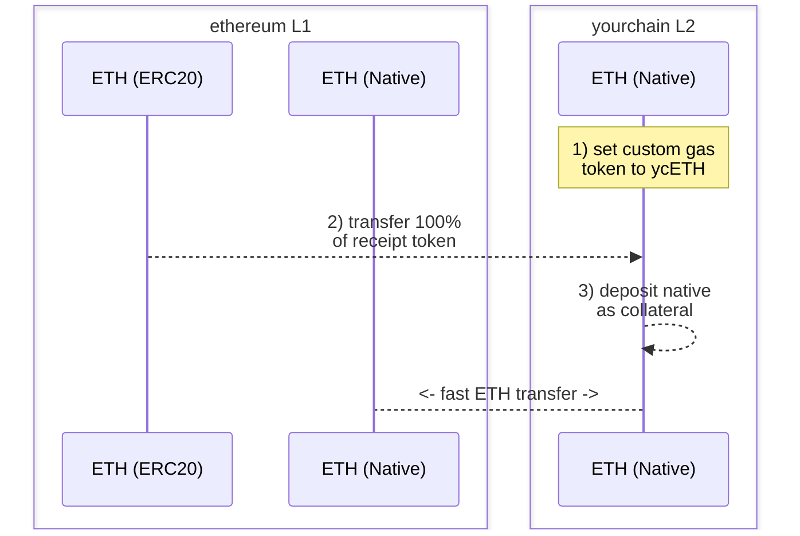

本文档将指导您如何使用 Hyperlane 通过自定义 gas 代币实现与您的 L2 之间的快速原生转账。

## 主要动机

1. 创建在您选择的 L2 上使用的自定义 gas 代币。
2. 使用此 gas 代币启用快速原生转账，而不是通过规范桥接器等待漫长的结算时间。

## 前置条件

要完成以下操作步骤，您应该具备以下条件：

1. 一个 L2 网络（"yourchain"），您能够在其上指定[自定义 gas 代币](https://docs.arbitrum.io/launch-orbit-chain/how-tos/use-a-custom-gas-token)并希望启用与其之间的快速原生转账。
2. 唯一的部署者或授权所有者来接收收据代币的铸造（下面有关此代币的更多信息）。
3. 已安装的 [Hyperlane CLI](https://docs.hyperlane.xyz/docs/reference/developer-tools/cli) 实例和来源为 `HYP_KEY` 的钱包私钥，在所有相关网络上有资金。

## 操作步骤：快速原生转账

<Info>
  - 请注意，下面的"收据代币"是一个（一次性）可铸造的"虚拟"代币，用于在 yourchain 对应的 L1 上抵押 warp-route。您将在创建后销毁该代币的铸造权。 - 另外，根据您的 L2，您的自定义 gas 代币的代币符号可能会被分配与您的收据代币相同的符号。如果在 ethereum 上部署，您可能希望将符号设置为 `ETH`。
</Info>

### 1. 部署收据代币

在 ethereum 上部署 `ETH` 收据代币，成为您 L2 的自定义 gas 代币。

1. 例如，您可以通过 [Remix](https://remix.ethereum.org/) 使用有资金的钱包和类似以下的合约部署您的收据代币：

   ```solidity
   // SPDX-License-Identifier: MIT
   pragma solidity ^0.8.20;

   import "@openzeppelin/contracts/token/ERC20/ERC20.sol";

   contract YourchainETH is ERC20 {
       constructor() ERC20("YourchainETH", "ETH") {
           _mint(msg.sender, 10000000 * (10 ** 18));
       }
   }
   ```

2. 确保您的 `ETH` 收据代币的 100% 总供应量铸造给部署者或选择的授权地址。这必须是一次性铸造事件，以避免下面的 ethereum ↔ yourchain 原生 HWR 的价值稀释。
3. 部署后，保存合约地址以供下面使用。

### 2. 设置自定义 Gas 代币

将 yourchain 上的自定义 gas 代币设置为新部署的 `ETH` ERC20 收据代币。

1. 使用 OP stack 设置自定义 gas 代币：https://docs.optimism.io/builders/chain-operators/features/custom-gas-token
2. 使用 arbitrum orbit 设置自定义 gas 代币：https://docs.arbitrum.io/launch-orbit-chain/how-tos/use-a-custom-gas-token

### 3. 转移所有收据代币

使用您的 L2 规范桥接器将 100% 的 `ETH` 收据代币从 ethereum 转移到 yourchain。

1. 使用 OP stack 标准桥接器转移：https://docs.optimism.io/builders/app-developers/bridging/standard-bridge
2. 使用 arbitrum orbit 桥接器转移：https://docs.arbitrum.io/launch-orbit-chain/how-tos/add-orbit-chain-to-bridge-ui

### 4. 部署原生 Hyperlane Warp Route (HWR)

使用 Hyperlane CLI，部署 ethereum `ETH` EvmHypNative ↔ yourchain `ETH` EvmHypNative HWR：

1. 运行 `hyperlane warp init` 并完成以下流程：
   1. 使用空格选择 `ethereum` 和 `yourchain`，然后按回车。
   2. 对于 ethereum，选择 `native` 并接受 mailbox。
   3. 对于 yourchain，选择 `native` 并接受 mailbox。
2. 在执行部署之前，确保 yourchain 的 `metadata.yaml` 定义了 `blockExplorers` 字段。这将是合约验证所需的，以便轻松抵押 yourchain 的 HWR。
3. 运行 `hyperlane warp deploy` 并确认 warp 部署配置符合预期。
4. 执行后，您的 `yourchain-ethereum-config.yaml` 部署文件将类似于以下内容：

   ```solidity
   # yaml-language-server: $schema=../schema.json
   tokens:
     - addressOrDenom: "0x3e5bB1a03fef5DB15A320885E6A0C8Bff8b656bd"
       chainName: yourchain
       connections:
         - token: ethereum|ethereum|0x6d64832bDB4F04721D4F23CCbF17326cb636101e
       decimals: 18
       name: Ether
       standard: EvmHypNative
       symbol: ETH
     - addressOrDenom: "0x6d64832bDB4F04721D4F23CCbF17326cb636101e"
       chainName: ethereum
       connections:
         - token: ethereum|yourchain|0x3e5bB1a03fef5DB15A320885E6A0C8Bff8b656bd
       decimals: 18
       name: Ether
       standard: EvmHypNative
       symbol: ETH

   ```

### 5. 抵押您的 HWR

通过 `receive()` 函数将 yourchain `ETH` 作为抵押品存入 yourchain 的原生 HWR。如果需要，您可以使用已验证的合约通过扫描器的 UI 或 Metamask 等钱包执行此操作

这抵押了原生 HWR，使用户能够快速将其原生资产桥接到 yourchain 和从 yourchain 桥接。

### 6. 测试

您可以使用以下命令启动单个 wei 的测试转账：

```bash
hyperlane warp send --relay --symbol ETH
```

`--relay` 标志是可选的，将消息中继到目标链。

您也可以在后台运行仅为您的 HWR 提供服务的 relayer (中继器)：

```bash
hyperlane relayer --symbol TOKEN
```

您可以在设置 HWR 的任何方向进行测试。

<Info>
  默认情况下，您的 warp 核心配置位于本地 Registry 的 `$HOME/.hyperlane/deployments/warp_routes` 中，与 `--warp` 标志一起使用。
</Info>

<Check>
  🎉 恭喜！您现在已经通过您的 L2 上的自定义 gas 代币启用了与 yourchain 之间的快速原生转账。
</Check>



<Warning>
  请注意，此抵押策略承担某些 ISM 信任假设。
</Warning>

## 资源

查看 [inEVM bridge](https://bridge.inevm.com/) 以了解这些 HWRs 的实际应用示例。

查看由 Hyperlane 支持团队和 Injective 发布的一些附加信息：

- [inEVM Spotlight: Hyperlane](https://blog.injective.com/en/inevm-spotlight-hyperlane-2/)
- [Connecting Injective: Hyperlane Opens the inEVM Bridge](https://medium.com/hyperlane/connecting-injective-hyperlane-opens-the-inevm-bridge-6f1d3edf0ff8)
- [Hyperlane and Injective | Expanding opportunities](https://medium.com/@kobriyyu/hyperlane-and-injective-expanding-opportunities-8ce170b72da7)