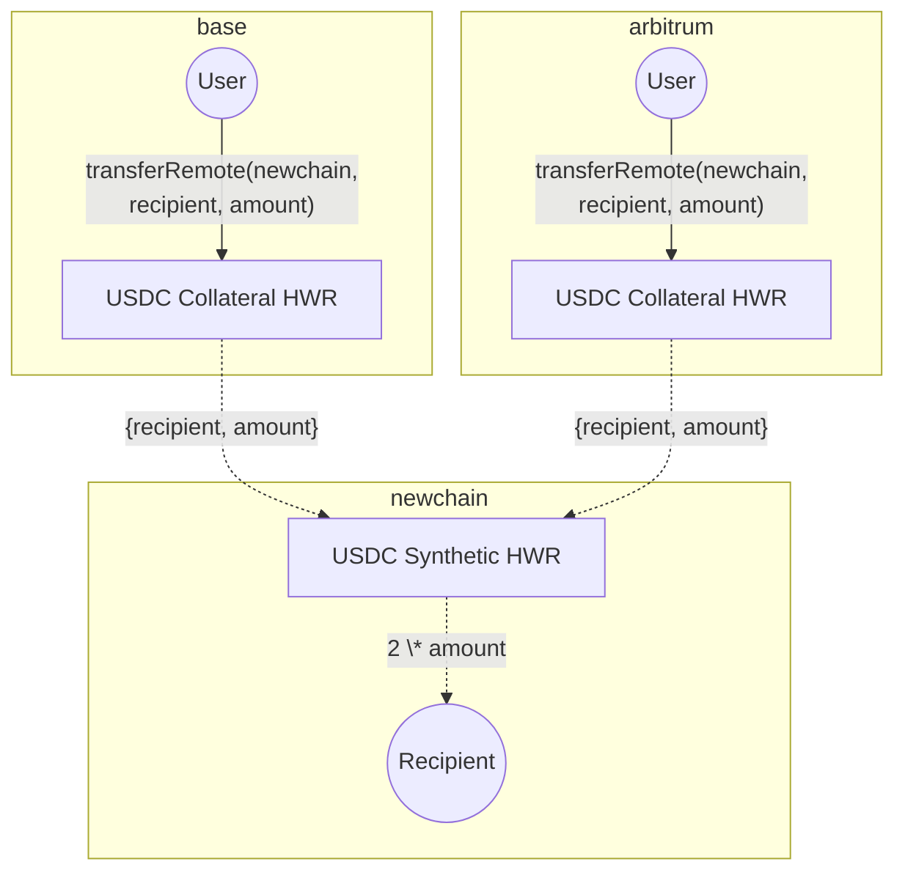
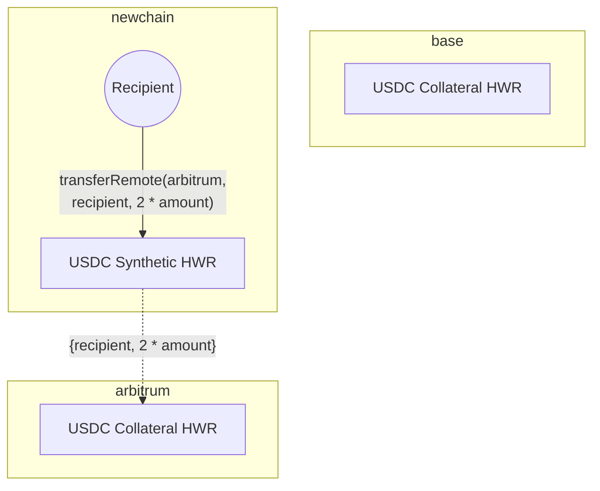
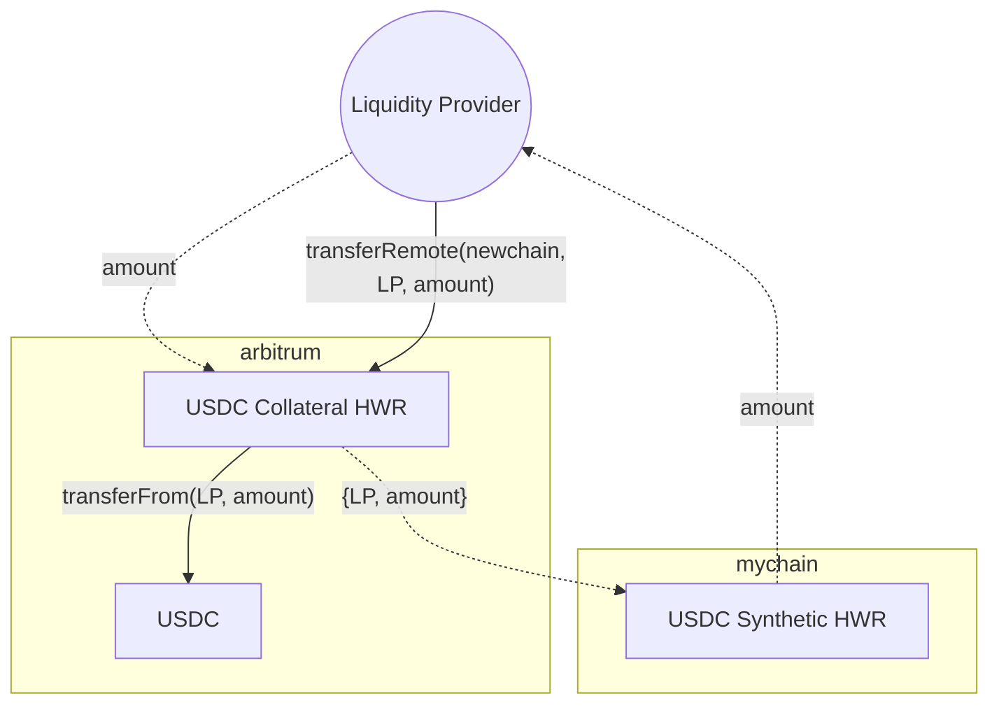

链希望允许用户从多个网络存入和提取代币，因为用户越来越多地在不同链上持有资产，并期望无缝的跨链体验。然而，手动管理所有这些链上的代币流动性可能很复杂且运营密集。

**Hyperlane Warp Route (HWR) 2.0** 消除了管理多链代币流动性的复杂性，同时使用户能够从任何支持的链向目标链存入代币。HWR 2.0 不是手动在链间重新平衡抵押品，而是自动维护链在需要时、在需要的地方的流动性。

## 流动性不平衡挑战

当在多个链上部署资产（如 USDC、USDT、ETH）作为封装代币时，流动性管理变得必要。

流动性在以下情况下变得不平衡：

- 用户在链 A 上存入代币但从链 B 提取
- 链 B 的代币用完
- 新用户无法从链 B 提取，直到有人手动将代币从链 A 移动到链 B

## 解决方案：原生再平衡

HWR 2.0 通过新的 **Rebalancer Agent (再平衡代理)** 和智能合约支持解决了流动性不平衡问题。Warp Route 合约已升级以启用新功能，具有合约所有者控制的再平衡器角色。

### Rebalancer (再平衡器)

HWR 2.0 包含内置的 **Rebalancer (再平衡器)**。Rebalancer (再平衡器) 是一个白名单代理，持续监控和管理 warp route 中所有链的抵押品。此代理使用外部/原生桥接器如 CCTP 或 Everclear 等协议自动在链间移动资金，维持最佳流动性分布。

例如，如果用户在 Arbitrum 上存入 USDC 并在 Base 上提取，Rebalancer (再平衡器) 可以使用 CCTP 将 USDC 从 Arbitrum 转移到 Base，以维持 Base 上的充足流动性。

### 原生再平衡启用的功能

这启用了：

- 从任何支持的链存入
- 提取到任何支持的链
- 无缝的用户体验

再平衡器角色可以由合约所有者允许的任何人操作。Abacus Works 将此作为托管服务提供，基于可配置的阈值和策略进行再平衡，这些策略确定何时以及如何移动抵押品。

## 工作原理

### 基本设置

下面的图表显示了在 Base 和 Arbitrum 上存在规范 USDC，在新链上创建合成 HWR 的设置。



### 抵押品不平衡

如果更多资金单向流动，路由中的其中一个链可能会用完抵押品。这种 _不平衡流动_ 会阻止提取，直到抵押品重新平衡。



### 管理抵押品不平衡

为了维持流畅的用户体验，必须在链间平衡抵押品。HWR 2.0 引入了自动化此过程的原生再平衡功能（在支持的地方）- 抵押品自动在链间移动以解决不平衡。对于没有原生再平衡的部署，这需要手动在链间移动抵押品。

### 原生再平衡的要求

对于原生再平衡，必须满足以下要求：

- Rebalancer Agent (再平衡代理)（监控和管理抵押品的白名单代理）
- 支持再平衡器角色的 Warp Route 合约
- 原生/外部桥接器或协议，通常在主要链上可用。例如，USDC 的 CCTP。

这些组件共同创建完整的原生再平衡系统。

<Warning>
  没有原生桥接支持或外部协议集成的链无法支持此功能。
</Warning>

## 手动再平衡

<Note>
  本节适用于手动管理流动性的高级用户。建议在可用的地方使用自动再平衡器。
</Note>

### 流动性提供者

目前，Hyperlane Warp Routes 2.0 没有明确的流动性提供者接口来启用本地存款/提取。但是，LPs 可以使用 [Hyperlane CLI](https://www.npmjs.com/package/@hyperlane-xyz/cli) 或 UI 手动管理流动性，与 [Hyperlane registry](https://github.com/hyperlane-xyz/hyperlane-registry) 中的 HWRs 交互。

<Warning>
  下面定义的临时程序要求 HWR 拓扑中至少存在一个合成链。
</Warning>

- 要检查 HWRs 拓扑，使用 `warp read` 命令：

```
hyperlane warp read --symbol ETH

ethereum:
    type: native
    ...
base:
    type: native
    ...
bsc:
    type: synthetic
    ...
```

- 要在 HWR 上发送转账（`transferRemote`），使用 `warp send` 命令：

```
hyperlane warp send \
	--symbol ETH \
	--origin base \
    --destination bsc \
	--amount <AMOUNT> \
	--recipient <ADDRESS>
```

### 存入流动性

LPs 可以通过 `transferRemote` 存入抵押品，其中：

- `destination` 域是 HWRs 具有 `synthetic` 类型的链
- `recipient` 地址由 LP 控制
- `amount` 是以 `origin` 链的 `collateral` 代币计价的流动性



这可以通过在许多抵押链上提供流动性并用单一合成资产余额表示对每个抵押品的索取权来完成。

### 提取流动性

LPs 可以通过 `transferRemote` 提取，其中

- `destination` 域是 HWR 为 `collateral` 类型的链
- `recipient` 地址由 LP 控制
- `amount` 以 `destination` 链的 `collateral` 代币计价

```mermaid
flowchart
	LP((Liquidity Provider))

	subgraph arbitrum
		AWR[USDC Collateral HWR]
		AUSDC[USDC]
	end

	subgraph mychain
		MWR[USDC Synthetic HWR]
	end

	LP -- "transferRemote(arbitrum,<br>LP, amount)" --> MWR
	LP -. "amount" .-> MWR

	MWR -. "{LP, amount}" .-> AWR
	AWR -- "transfer(LP, amount)" --> AUSDC
	AWR -. "amount" .-> LP