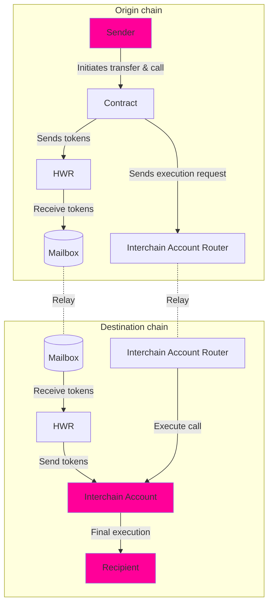

## 概述

**转账和调用模式** 使合约能够通过 [Hyperlane Warp Route (HWR) (跨链资产路由)](/docs/protocol/warp-routes/warp-routes-overview) 桥接资产，并在资产到达后在目标链上执行操作。此模式对于操作依赖于桥接后的代币余额的情况很有用。

虽然 HWR 处理跨链代币转账，但此模式通过使用 [Interchain Accounts (ICA) (跨链账户)](/docs/applications/interchain-account) 在目标链上执行任意逻辑来扩展其功能。

### 使用案例

一些场景包括：

- **跨链治理**：用户必须持有特定 NFT 才能对提案进行投票。系统将 NFT 桥接到治理链，并确保投票调用在转账完成后执行。
- **桥接抵押品**：协议将资产从 L2 发送到 L1 保险库进行抵押，然后与保险库交互。
- **更快的 rollup 提取**：用户可以立即索取流动性，同时等待最终桥接结算。

## 高层架构图



<Info>
  - 目前，Interchain Accounts (ICA) (跨链账户) 仅在兼容 EVM 的
  链上受支持。如果需要更广泛的 VM 支持，此模式可以扩展到其他环境，
  可能需要额外的设计考虑。
</Info>

## 工作原理

1. 代币从发送方转移到合约。
2. 在目标链上为合约导出 [Interchain Account (ICA) (跨链账户)](/docs/applications/interchain-account)。
3. 启动 HWR 转账，将代币跨链发送到跨链账户。
4. 在代币到达后，从跨链账户在目标链上执行远程合约调用。

下面的 Solidity 函数演示了此模式：

```solidity
function transferAndCall(
    uint32 destination,
    uint256 amount,
    IERC20 asset, // Tokens to transfer (not derivable from TokenRouter)
    TokenRouter warpRoute,
    CallLib.Call[] calldata calls // Array of calls to execute on the destination chain
) external payable {

    // Transfer the specified amount of tokens from the sender to this contract
    asset.transferFrom(msg.sender, address(this), amount);

    // Get the interchain account address for the contract on the destination chain
    bytes32 self = interchainAccountRouter
        .getRemoteInterchainAccount(destination, address(this))
        .addressToBytes32();

    // Quote the gas fee for the HWR payment
    uint256 warpFee = warpRoute.quoteGasPayment(destination);

    // Initiate the HWR transfer to send tokens cross-chain
    warpRoute.transferRemote{value: warpFee}(destination, self, amount);

    // Execute the specified interchain calls using the remaining gas funds
    interchainAccountRouter.callRemote{value: msg.value - warpFee}(
        destination,
        calls
    );
}
```

<Info>
  - **执行顺序考虑**：合约必须确保代币转账完全完成后才执行任何后续操作。如果远程调用依赖于代币余额（例如，质押、治理、存款），如果在代币到达之前执行，可能会失败。relayer (中继器) 会使用退避重试以确保成功的 ICA 调用执行。 - ICA 在执行存款之前可能还需要执行 ERC20 批准调用。 - 如果执行操作的合约没有权限限制，任何人都可以调用它（取决于其实现）。
</Info>