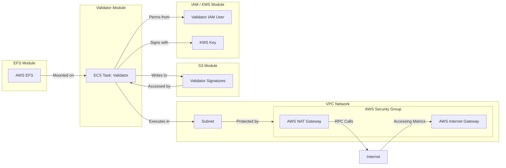
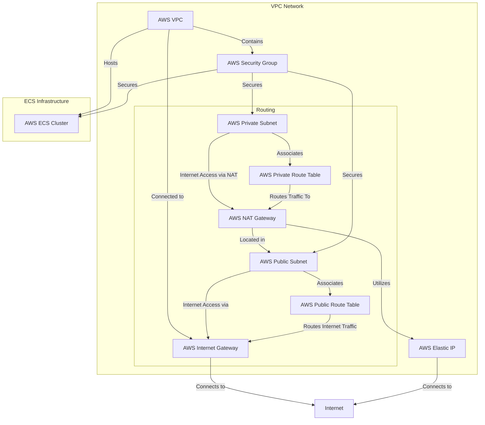

对于那些更熟悉通过基础设施即代码工具（如 Terraform）部署到 AWS 的人，我们在 [**GitHub 上提供了一个示例配置**](https://github.com/hyperlane-xyz/hyperlane-monorepo/tree/main/rust/main/terraform)，旨在为 AWS 上的 Hyperlane Validator 设置必要的基础设施。它自动创建运行 Validator agent 所需的资源，例如 ECS 集群、VPC、子网和安全组。

<Warning>
  提供的配置仅旨在作为为核心支持网络运行 Validator 的*示例*。您可能需要修改 Validator 模块以支持更高级的配置。建议在生产环境中使用此设置之前进行彻底测试。
</Warning>

## 概述

提供的 terraform 有几个关键部分：

- IAM/KMS 模块：自动为您完成 [Agent 密钥](/docs/operate/set-up-agent-keys)配置。
- S3 模块：自动为您完成 [AWS 签名桶](/docs/operate/validators/validator-signatures-aws)配置。
- EFS 模块：设置可以挂载到 Validator 的持久卷。
- Validator 模块：使用上述模块运行 Validator 实例。
- `global.tf`：Validator 可以在其中运行的集群的顶级网络配置。
- `main.tf`：配置要部署的 Validator。

下图显示了它们如何组合在一起。



## 使用

作为前提条件，您需要安装 Terraform 并使用您的凭据配置 AWS CLI。

要初始化 terraform 状态：

```bash
terraform init
```

要生成基础设施更改计划：

```bash
terraform plan
```

要预览并应用基础设施更改：

```bash
terraform apply
```

要列出 KMS、IAM 或 S3 信息等输出，您需要解析 JSON 输出：

```bash
terraform output -json
```

## 模块

存在多个模块，因此您可以选择要由 terraform 管理的 Validator 设置的哪些部分。

### IAM / KMS

`iam_kms` 模块创建 IAM 用户和 KMS 密钥以进行安全签名操作。它还设置 IAM 策略和附件，以授予使用 KMS 密钥和其他 AWS 服务（如 S3、EFS 和 ECS）所需的权限。

### S3

`s3` 模块创建 S3 存储桶以存储与 Validator 相关的数据，例如签名。它还设置存储桶策略以管理访问和权限，包括公共访问限制和版本控制。

### EFS

`efs` 模块定义 EFS 文件系统和访问点，允许 Validator 应用程序在 EFS 上存储和访问数据。它还设置挂载目标以将 EFS 文件系统连接到网络。

<Note>仅在使用 `validator` 模块时才需要此模块。</Note>

### Validator

`validator` 模块使用上述所有模块来集成 EFS、IAM/KMS 和 S3 配置。

除了：

- 创建新的 IAM 用户和相关角色以运行 Validator。
- 创建 Validator 可以向其写入签名的 S3 存储桶。
- 创建 EFS 卷以在服务中持久化数据。

此模块还：

- 定义用于运行 Validator 应用程序的 ECS 任务定义，包括容器定义、卷配置和日志记录。
- 创建 ECS 服务来管理 Validator 任务的部署和扩展。

## 主配置

根级配置为网络基础设施设置 VPC、子网、互联网网关、NAT 网关、路由表和安全组。它还提供了 `validator` 模块的示例用法。

```hcl
module "your_validator_name" {
  source = "./modules/validator"

  validator_name    = "your-validator-name"
  origin_chain_name = "originChainName"

  aws_region               = var.aws_region
  validator_cluster_id     = aws_ecs_cluster.validator_cluster.id
  validator_subnet_id      = aws_subnet.validator_subnet.id
  validator_sg_id          = aws_security_group.validator_sg.id
  validator_nat_gateway_id = aws_nat_gateway.validator_nat_gateway.id

  # Disabling the Validator task allows you to set up all the required infrastructure
  # without running the actual Validator yet. This is useful when setting up a Validator for
  # the first time, so that you can find out the Validator's address and fund it before it
  # performs the announcement transaction.
  # validator_task_disabled = true
}
```

### 输出

根级 `outputs.tf` 转发 `main.tf` 中配置的所有 Validator 的所有输出。**您必须在添加、修改或删除 Validator 时更新此文件。**

### 示例架构

下图显示了 Validator ECS 集群如何适应顶级网络基础设施。



## 已知问题

### PI 配置

为 PI 链设置自定义配置值并不简单，例如您自己部署 Hyperlane 的链。目前，您可能只需传递一长串环境变量或命令行参数。

### 单个 agent 日志

目前所有 agent 都记录到同一个日志组 - `DefaultLogGroup`。要按 agent 分隔它们，您可能需要调整日志组名称并使用新组名称更新 agent 的日志策略。

### Relayer 模块

docker 镜像支持运行两种类型的 agent。因此，如果您选择这样做，可以使用 Validator 模块作为新 Relayer 模块的起点。