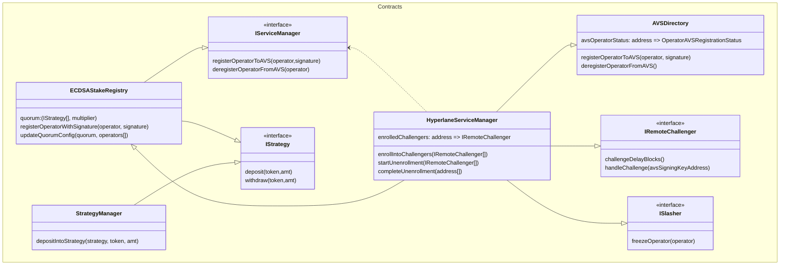
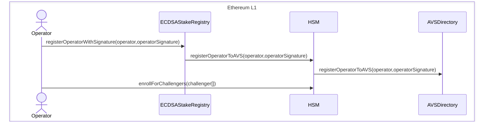
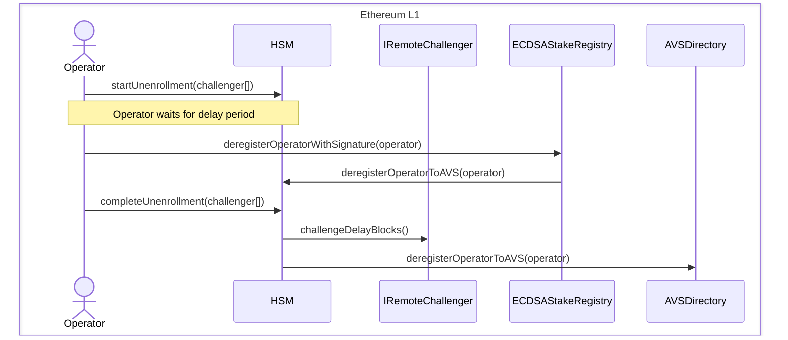
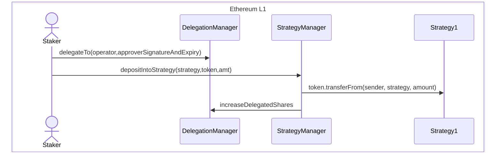
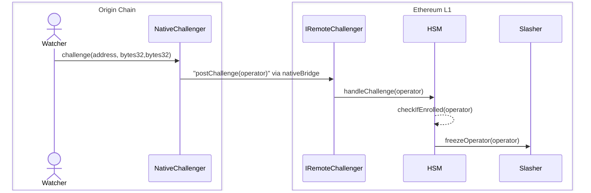

本指南将帮助您了解构建在 EigenLayer（以太坊重新质押协议）之上的 Hyperlane AVS（主动验证服务）模块。

Hyperlane 目前采用权威证明模型来保证安全性，其中选择一组受信任的 Validator 来维护[安全性](/docs/protocol/ISM/standard-ISMs/multisig-ISM)。然而，如果任何 Validator 错误签署或出于恶意签署，由于这些 Validator 没有经济质押，因此不会有任何后果。这就是 AVS 模块旨在解决的差距。

```mermaid
flowchart TB
    subgraph Ethereum
      Staker
      Operator
      EL[EigenLayer]
      H_AVS[Hyperlane AVS]
      CH1[Challenger1]
      CH2[Challenger2]
      CH3[Challenger3]

      Operator -- "(de)register()" --> H_AVS
      Staker -- "deposit(operator)" --> EL

      H_AVS <-..-> EL
      CH1 -. "handleChallenge(operator)" .-> H_AVS
      CH2 -. "handleChallenge(operator)" .-> H_AVS
      CH3 -. "handleChallenge(operator)" .-> H_AVS

      style H_AVS fill: #FF0099
      style EL fill: #1a0c6d
      style CH1 fill: #006400
      style CH2 fill: #006400
      style CH3 fill: #006400
    end
```



AVS 模块在 Hyperlane 协议中独特地启用了[经济安全](/docs/protocol/ISM/economic-security/overview)，以最小的成本为其支持的每条链引导新的 Validator 网络。这是通过利用可以保护 rollup 之间和来自 rollup 的出站消息的共享质押池来实现的。此过程中的主要利益相关者是：

- **Operator（运营商）** - 选择加入 Hyperlane AVS 服务并开始验证指定链的出站消息的 EigenLayer operator
- **Staker（质押者）** - 将其质押委托给 operator 以保护网络的 EigenLayer staker
- **Application（应用程序）** - 利用 Hyperlane 寻求跨链经济安全保护其消息的应用程序

<Warning>
  EigenLayer 的罚没和奖励支付尚未启用。除了 AVS 之外，还必须在[跨链安全模块 (ISM)](/docs/protocol/ISM/modular-security) 中设置签名和验证。
</Warning>

### 架构



上面的类图描述了当前 AVS 模块合约的架构。至关重要的是，它描述了我们通过 `IRemoteChallenger` 接口支持的 _"metaAVS"_ 设计模式。

### `IRemoteChallenger`

Hyperlane 上的 Operator 可以灵活地在其选择的链上运行，使 AVS 模块能够适应任何链或挑战者。然而，这种灵活性可能导致主网上缺乏普遍接受的用于罚没的"规范"真相来源。这是因为欺诈只能在源链上证明，因此需要一种方法将该信息传输到质押所在的链。

秉承无需许可互操作性的精神，我们认为应用程序开发者应该有能力定义自己的真相来源，并为其应用程序的经济安全建立保证。这包括编程挑战条件和罚没窗口的能力。

为了实现这种级别的自定义，我们引入了 `IRemoteChallenger` 接口。只有当 `ism.verify()` 在源自检测到欺诈性签名的链的 L1 上成功执行时，才会调用 `handleChallenge` 函数。如上所述，为这个底层 ISM 设置强大的安全措施至关重要。

```solidity
interface IRemoteChallenger {
    /// @notice Returns the number of blocks that must be mined before a challenge can be handled
    /// @return The number of blocks that must be mined before a challenge can be handled
    function challengeDelayBlocks() external view returns (uint256);

    /// @notice Handles a challenge for an operator
    /// @param operator The address of the operator
    function handleChallenge(address operator) external;
}
```

此配置应该是不可变的，并且可供任何 AVS operator 查看和选择加入。`handleChallenge` 函数明确编码了您期望如何将来自源链（例如 Arbitrum）的挑战传递到 AVS 合约和 `IRemoteChallenger` 所在的 Ethereum 主网。

对于 Arbitrum，它可以是 rollup 的原生桥接，对于另一个 L1，它可以是基于委员会的解决方案。我们的接口对挑战者实现无关，以允许在这个设计领域具有灵活性。这允许我们在 L1 上 `ism.verify()` 成功后通过调用 `handleChallenge()` 来重用现有的 hook-ISM 设置。在使用 rollup 原生桥接的情况下，合理的 `challengeDelayBlocks` 应该略长于一周。

作为 operator，您应该审查不同的 `IRemoteChallenger` 合约并评估其风险和回报。如果感兴趣，您可以直接从 `HyperlaneServiceManager` 合约注册到一个或多个挑战者。

<Note>
  IRemoteChallenger 实现尚未在生产环境中上线。
</Note>

### 注册工作流程

前提条件：operator 必须注册为 EigenLayer Operator（通过其 CLI）



Operator 需要注册到特定的挑战者以允许通过无需许可的罚没实现经济安全。作为 operator，您可以检查每个远程挑战者，并根据风险自行选择要加入哪些挑战者。这也意味着没有中心化的许可或白名单会成为为不同 rollup 堆栈添加挑战者的瓶颈。operator 将能够在注销延迟区块过后注销。

### 注销工作流程



Operator 只能在从他们注册的所有挑战者中注销后才能注销自己，每个挑战者都可以有自己的延迟期。这是为了确保 operator 在任何挑战者的挑战期过去之前无法提取其质押。

### 质押工作流程



在 EigenLayer 的设计中，staker 资金受到保护，因为在启用罚没之前不会将其提供给 AVS。这确保没有资金过早面临风险。此外，此设计不允许用户单独选择加入 Hyperlane AVS，因为质押通过 StrategyManager 管理并针对特定的 operator。

### 罚没工作流程



罚没机制设计为无需许可且灵活。`IRemoteChallenger` 接口允许罚没机制的不同实现。例如，`postChallenge` 函数由源链上的原生挑战者调用，然后在 `HyperlaneServiceManager` 合约上调用 `handleChallenge` 函数。`HyperlaneServiceManager` 合约然后检查 operator 是否已注册到挑战者，并在 `Slasher` 合约上调用 `freezeOperator` 函数以冻结 operator 的质押。

<Note>
  挑战者和罚没合约尚未在生产环境中上线。此序列图可能会根据最终实现而更改。
</Note>

### 合约部署

#### Ethereum

| 名称                                                                                                                                                                            | Proxy                                                                                                                 | Implementation                                                                                                        |
| ------------------------------------------------------------------------------------------------------------------------------------------------------------------------------- | --------------------------------------------------------------------------------------------------------------------- | --------------------------------------------------------------------------------------------------------------------- |
| [ECDSAStakeRegistry](https://github.com/hyperlane-xyz/hyperlane-monorepo/blob/f0df1a4cd1a9a6ec2e01b106941a2d4e42e5ba18/solidity/contracts/avs/ECDSAStakeRegistry.sol)           | [0x272CF0BB70D3B4f79414E0823B426d2EaFd48910](https://etherscan.io/address/0x272CF0BB70D3B4f79414E0823B426d2EaFd48910) | [0xa11b1a385287b5167ecca6a38f63abeab981d589](https://etherscan.io/address/0xa11b1a385287b5167ecca6a38f63abeab981d589) |
| [HyperlaneServiceManager](https://github.com/hyperlane-xyz/hyperlane-monorepo/blob/f0df1a4cd1a9a6ec2e01b106941a2d4e42e5ba18/solidity/contracts/avs/HyperlaneServiceManager.sol) | [0xe8E59c6C8B56F2c178f63BCFC4ce5e5e2359c8fc](https://etherscan.io/address/0xe8E59c6C8B56F2c178f63BCFC4ce5e5e2359c8fc) | [0x3127e69517ec2268dd5745c97194d387a4fc0c45](https://etherscan.io/address/0x3127e69517ec2268dd5745c97194d387a4fc0c45) |

#### Holesky

| 名称                                                                                                                                                                            | Proxy                                                                                                                         | Implementation                                                                                                                |
| ------------------------------------------------------------------------------------------------------------------------------------------------------------------------------- | ----------------------------------------------------------------------------------------------------------------------------- | ----------------------------------------------------------------------------------------------------------------------------- |
| [ECDSAStakeRegistry](https://github.com/hyperlane-xyz/hyperlane-monorepo/blob/f0df1a4cd1a9a6ec2e01b106941a2d4e42e5ba18/solidity/contracts/avs/ECDSAStakeRegistry.sol)           | [0xFfa913705484C9BAea32Ffe9945BeA099A1DFF72](https://holesky.etherscan.io/address/0xFfa913705484C9BAea32Ffe9945BeA099A1DFF72) | [0x628bc518ed1e0e8c6cbcd574eba0ee29e7f6943e](https://holesky.etherscan.io/address/0x628bc518ed1e0e8c6cbcd574eba0ee29e7f6943e) |
| [HyperlaneServiceManager](https://github.com/hyperlane-xyz/hyperlane-monorepo/blob/f0df1a4cd1a9a6ec2e01b106941a2d4e42e5ba18/solidity/contracts/avs/HyperlaneServiceManager.sol) | [0xc76E477437065093D353b7d56c81ff54D167B0Ab](https://holesky.etherscan.io/address/0xc76E477437065093D353b7d56c81ff54D167B0Ab) | [0xa3ab7e6ce24e6293bd5320a53329ef2f4de73fca](https://holesky.etherscan.io/address/0xa3ab7e6ce24e6293bd5320a53329ef2f4de73fca) |
