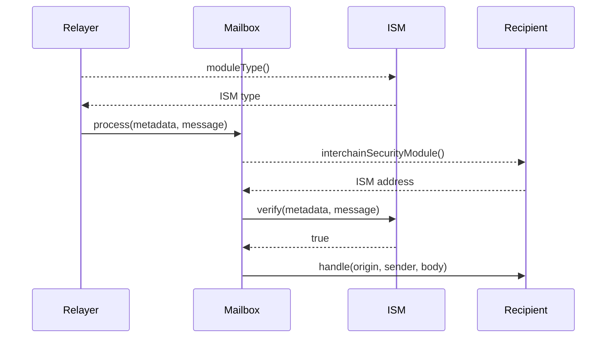

当在链之间发送消息时，它会经过验证过程以确保其真实性。本页面解释该过程的工作原理。

## 概述

验证过程涉及三个关键组件：

1. **Mailbox 合约** - 消息处理的主要入口点
2. **ISM（跨链安全模块）** - 安全验证合约
3. **接收者合约** - 接收消息的应用程序

## 序列图

<Note>

- 如果接收者未实现 `ISpecifiesInterchainSecurityModule` 或 `recipient.interchainSecurityModule()` 返回 `address(0)`，则将使用在 [Mailbox](/docs/protocol/core/mailbox) 上配置的默认 ISM 来验证消息。
- 为清晰起见，这在序列图中省略了。

</Note>

## 工作原理

1. **类型识别**

   - Relayer 在 ISM 上调用 `moduleType()` 以确定其类别
   - 根据此类型（例如 `MULTISIG`、`ROUTING`、`AGGREGATION`），Relayer 知道要收集什么验证证明
   - 对于多重签名 ISM，这意味着从 Validator 收集加密签名

2. **消息提交**

   - Relayer 调用 `Mailbox.process()`，提供：
     - 原始消息
     - 收集的验证元数据

3. **验证过程**

   - Mailbox 通过 `interchainSecurityModule()` 查询接收者合约
   - 如果未指定 ISM，Mailbox 使用默认 ISM
   - 然后 Mailbox 将消息和元数据转发到 ISM 的 `verify()` 函数
   - ISM 执行其安全逻辑（例如，签名验证、阈值检查）

4. **消息传递**

   - 验证成功后（当 `verify()` 返回 `true` 时），Mailbox 调用 `recipient.handle()`
   - 如果验证失败，交易回滚，消息被拒绝
