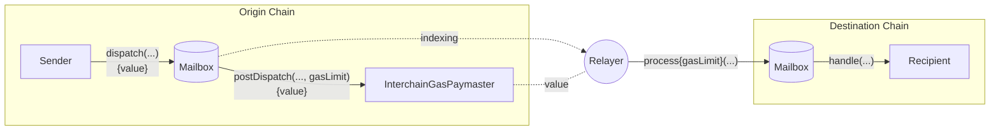
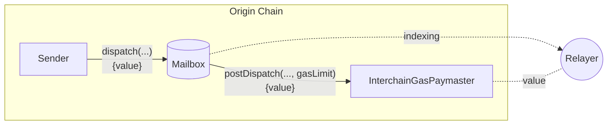
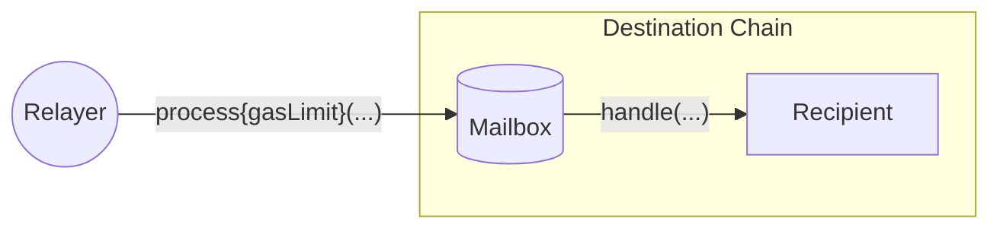

成功的跨链消息需要两笔交易；一笔在源链上发送消息，另一笔在目标链上传递消息。

为方便起见，Hyperlane 在源链上提供了一个链上接口，允许消息发送者向 [Relayer](/docs/protocol/agents/relayer) 支付[费用](#interchain-gas-payment-calculation)以在目标链上传递消息。这笔支付称为**跨链 gas 支付**。

## 跨链 Gas 支付流程

要[传递消息](/docs/reference/messaging/send)，必须在目标链上包含一笔交易，该交易使用编码的消息和 ISM 元数据调用 Mailbox `process` 函数。

为方便起见，[Relayer](/docs/operate/relayer/run-relayer) 会监视已调度的消息，如果在源链上收到足够的支付，将代表消息发送者提交 process 交易。这就是_跨链 gas 支付_。

由于消息可以触发任意代码执行，Relayer 必须使用 `gasLimit` 来计量 [`handle` 调用](/docs/reference/messaging/receive#handle)，以便在消息调度时适当收费。

## InterchainGasPaymasters

跨链 gas 支付由 `InterchainGasPaymaster` (IGP) 智能合约促成。

这些合约公开了 [InterchainGasPaymaster 接口](/docs/reference/hooks/interchain-gas)，允许消息发送者使用源链上的原生代币向 Relayer 支付费用，以支付在目标链上传递消息的成本。

每个 `InterchainGasPaymaster` 合约恰好对应一个 Relayer。您可以在[地址](/docs/reference/addresses/deployments/mainnet/interchainGasPaymaster)下找到 Abacus Works 的 Relayer 地址。

### 跨链 Gas 支付计算

跨链 gas 支付的计算方式如下：

$$
destinationTxCost = destinationGasPrice * gasLimit
$$

$$
exchangeRate = \frac{originGasTokenPrice}{destinationGasTokenPrice}
$$

$$
originFee = exchangeRate * destinationTxCost
$$

`gasLimit` 和 `exchangeRate` 分别由消息发送者和 Relayer 配置。

## 信任假设

跨链 gas 支付基于消息发送者和 Relayer 之间的社会契约。换句话说，Relayer 可能会接收跨链 gas 支付而不传递相应的消息。因此，在进行跨链 gas 支付时，建议使用与已知且信誉良好的 Relayer 相关联的 IGP 合约。

诚实的 Relayer 实现将履行对其 IGP 进行的任何成功 gas 支付，无论实际支付了多少代币。通过保持 [gas oracles](/docs/reference/hooks/interchain-gas) 最新，Relayer 可以确保 gas 支付成功当且仅当支付了"公平"价格。

在 Hyperlane 协议中，对 Relayer 没有信任假设，在任何情况下，恶意 Relayer 都无法审查或伪造消息。Relayer 能做的最坏的事情就是接受支付而不传递消息。

## 了解更多

- 有关 gas 限制计算、基准测试建议、gas oracles 和目标 gas 配置的详细信息，请参阅[跨链 Gas 支付详细信息](/docs/reference/hooks/interchain-gas)。
- 有关 Relayer 设置和实现指南，请参阅 [Relayer](/docs/operate/relayer/run-relayer) 部分。
