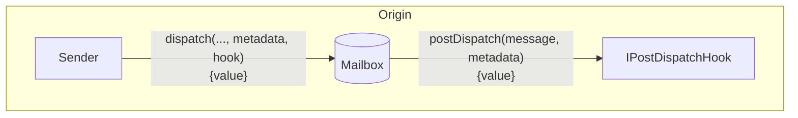
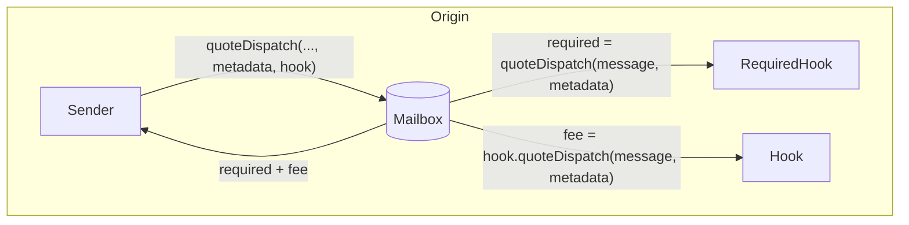
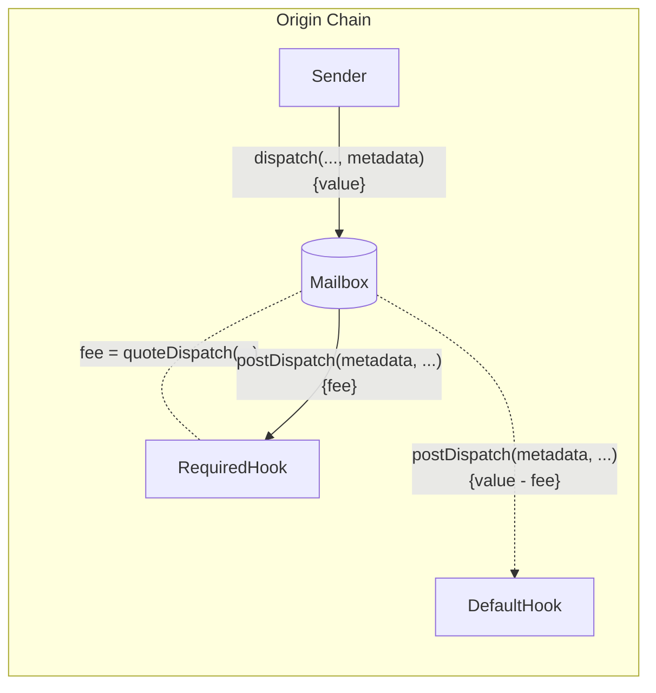

调度后钩子允许开发者使用通过 Mailbox 调度的消息内容配置额外的源链行为。



这允许开发者集成第三方/原生桥接、进行额外的链承诺或要求自定义费用，同时保持一致的单次调用 Mailbox 接口。

<Accordion title="`IPostDispatchHook` 接口">

<CodeGroup>

```solidity Solidity
// SPDX-License-Identifier: MIT OR Apache-2.0
pragma solidity >=0.8.0;

/*@@@@@@@       @@@@@@@@@
 @@@@@@@@@       @@@@@@@@@
  @@@@@@@@@       @@@@@@@@@
   @@@@@@@@@       @@@@@@@@@
    @@@@@@@@@@@@@@@@@@@@@@@@@
     @@@@@  HYPERLANE  @@@@@@@
    @@@@@@@@@@@@@@@@@@@@@@@@@
   @@@@@@@@@       @@@@@@@@@
  @@@@@@@@@       @@@@@@@@@
 @@@@@@@@@       @@@@@@@@@
@@@@@@@@@       @@@@@@@@*/

interface IPostDispatchHook {
    enum Types {
        UNUSED,
        ROUTING,
        AGGREGATION,
        MERKLE_TREE,
        INTERCHAIN_GAS_PAYMASTER,
        FALLBACK_ROUTING,
        ID_AUTH_ISM,
        PAUSABLE,
        PROTOCOL_FEE,
        LAYER_ZERO_V1,
        RATE_LIMITED,
        ARB_L2_TO_L1,
        OP_L2_TO_L1
    }

    /**
     * @notice Returns an enum that represents the type of hook
     */
    function hookType() external view returns (uint8);

    /**
     * @notice Returns whether the hook supports metadata
     * @param metadata metadata
     * @return Whether the hook supports metadata
     */
    function supportsMetadata(
        bytes calldata metadata
    ) external view returns (bool);

    /**
     * @notice Post action after a message is dispatched via the Mailbox
     * @param metadata The metadata required for the hook
     * @param message The message passed from the Mailbox.dispatch() call
     */
    function postDispatch(
        bytes calldata metadata,
        bytes calldata message
    ) external payable;

    /**
     * @notice Compute the payment required by the postDispatch call
     * @param metadata The metadata required for the hook
     * @param message The message passed from the Mailbox.dispatch() call
     * @return Quoted payment for the postDispatch call
     */
    function quoteDispatch(
        bytes calldata metadata,
        bytes calldata message
    ) external view returns (uint256);
}
```

</CodeGroup>

</Accordion>

## 调度后

除了通过 Mailbox 调度的 `message` 之外，`postDispatch` 函数还接收一个 `metadata` 参数。`metadata` 参数从 `dispatch` 调用通过 Mailbox 未经修改地传递。这允许开发者将他们希望的任何上下文传递给钩子。

<CodeGroup>

```solidity Solidity
function postDispatch(
    bytes calldata metadata,
    bytes calldata message
) external payable;
```

</CodeGroup>

如果 `postDispatch` 函数收到的支付不足，它可能会回滚。

<Note>
  调度后钩子可能是可重放的。创建自定义钩子的开发者应该实现安全检查以防止这种行为。
  [这里](https://github.com/hyperlane-xyz/hyperlane-monorepo/blob/b69bc23239ecfc8f8a6277bb0f9bc248cffea234/solidity/contracts/hooks/warp-route/RateLimitedHook.sol#L16)
  是一个示例实现。
</Note>

### Quote Dispatch（费用）

在 `postDispatch` 中通常会收取费用，以支付目标链交易提交和安全提供等成本。要接收相应 `postDispatch` 调用的报价，您可以查询 `quoteDispatch` 函数。

<CodeGroup>

```solidity Solidity
function quoteDispatch(
    bytes calldata metadata,
    bytes calldata message
) external view returns (uint256);
```

</CodeGroup>

Mailbox 有一个 `quoteDispatch` 函数，返回 `dispatch` 调用成功所需的总费用。



转到实现钩子指南[此处。](/docs/protocol/ISM/custom-ISM)

### 覆盖默认 Hook 元数据

要覆盖默认元数据，有一个 `dispatch` 重载，它接受一个可选的 `metadata` 参数。

<Note>
  钩子目前期望使用 [`StandardHookMetadata` 库](/docs/reference/developer-tools/libraries/hookmetadata)格式化元数据。
</Note>

<CodeGroup>

```solidity Solidity
function dispatch(
    uint32 destinationDomain,
    bytes32 recipientAddress,
    bytes calldata body,
    bytes calldata defaultHookMetadata
) external payable returns (bytes32 messageId);
```

</CodeGroup>

自定义 `metadata` 将传递给必需钩子的 `quoteDispatch` 和 `postDispatch` 函数，然后传递给默认钩子的 `postDispatch` 函数。



#### 示例

<Note>
  查看：[`StandardHookMetadata` 库](https://github.com/hyperlane-xyz/hyperlane-monorepo/blob/b69bc23239ecfc8f8a6277bb0f9bc248cffea234/solidity/contracts/hooks/libs/StandardHookMetadata.sol)
</Note>

<CodeGroup>

```solidity Solidity
// send message from originChain to destinationChain TestRecipient
IMailbox mailbox = IMailbox("mailboxAddress");
mailbox.dispatch{value: msg.value}(
  destinationDomain,
  "paddedRecipient", // Convert recipient address to padded bytes32 format
  bytes("messageBody"),
  StandardHookMetadata.overrideGasLimit(200000)
);
```

</CodeGroup>

### 自定义钩子和元数据

在实现上述接口后，您可以通过在我们的 mailbox 中使用重载的 `dispatch` 调用来覆盖默认钩子和钩子元数据：

<CodeGroup>

```solidity Solidity
function dispatch(
    uint32 destinationDomain,
    bytes32 recipientAddress,
    bytes calldata body,
    bytes calldata customHookMetadata,
    IPostDispatchHook customHook
) external payable returns (bytes32 messageId);
```

</CodeGroup>

#### 示例

<CodeGroup>

```solidity Example
// send message from originChain to destinationChain TestRecipient
IMailbox mailbox = IMailbox("mailboxAddress");
IPostDispatchHook merkleTree = IPostDispatchHook("merkleTreeHookAddress");
mailbox.dispatch(
  destinationDomain,
  "paddedRecipient", // Convert recipient address to padded bytes32 format
  bytes("messageBody"),
  "0x", // empty metadata
  merkleTree
);
```

</CodeGroup>
