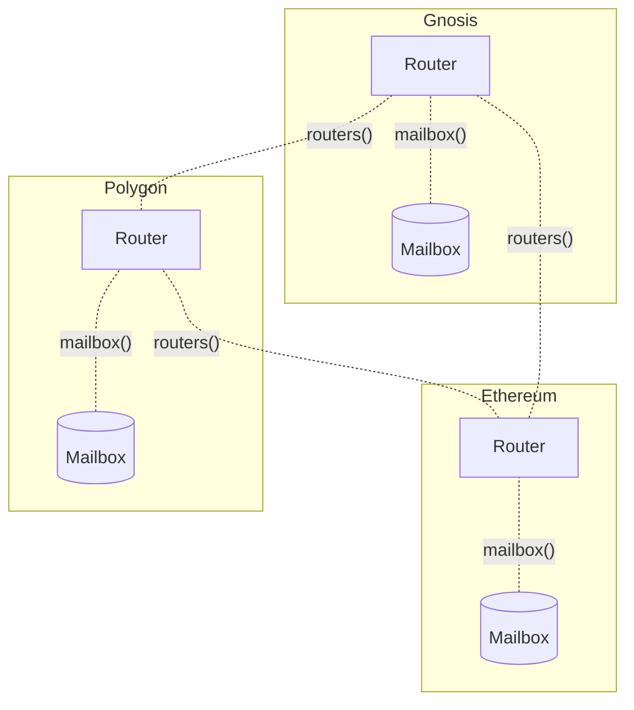

希望编写一次合约并将其部署到多条链上的应用开发者应考虑使用 [`Router`](https://github.com/hyperlane-xyz/hyperlane-monorepo/blob/v3/solidity/contracts/client/Router.sol) 模式进行构建。

在此模式中，应用合约的实例部署在每条应用支持的链上。每个实例都知道其他链上实例的地址。这些实例使用 Hyperlane 与远程链上的实例相互通信信息和状态。



使用此模式的开发者可以继承 `Router` 混入合约。`Router` 是一个 [`MailboxClient`](./mailbox-client)，它跟踪远程链上其他 `Router` 合约地址。这允许 `Router` 直接向其他 Router 发送消息，而无需指定地址。它还允许 `Router` 拒绝来自其他不受信任发送者的消息。

## Router 库

```solidity
// SPDX-License-Identifier: MIT OR Apache-2.0
pragma solidity >=0.6.11;

// ============ Internal Imports ============
import {IMessageRecipient} from "../interfaces/IMessageRecipient.sol";
import {IPostDispatchHook} from "../interfaces/hooks/IPostDispatchHook.sol";
import {IInterchainSecurityModule} from "../interfaces/IInterchainSecurityModule.sol";
import {MailboxClient} from "./MailboxClient.sol";
import {EnumerableMapExtended} from "../libs/EnumerableMapExtended.sol";
import {StandardHookMetadata} from "../hooks/libs/StandardHookMetadata.sol";

// ============ External Imports ============
import {Strings} from "@openzeppelin/contracts/utils/Strings.sol";

abstract contract Router is MailboxClient, IMessageRecipient {
    using EnumerableMapExtended for EnumerableMapExtended.UintToBytes32Map;
    using Strings for uint32;

    // ============ Mutable Storage ============
    EnumerableMapExtended.UintToBytes32Map internal _routers;

    uint256[48] private __GAP; // gap for upgrade safety

    constructor(address _mailbox) MailboxClient(_mailbox) {}

    // ============ External functions ============
    function domains() external view returns (uint32[] memory) {
        return _routers.uint32Keys();
    }

    /**
     * @notice Returns the address of the Router contract for the given domain
     * @param _domain The remote domain ID.
     * @dev Returns 0 address if no router is enrolled for the given domain
     * @return router The address of the Router contract for the given domain
     */
    function routers(uint32 _domain) public view virtual returns (bytes32) {
        (, bytes32 _router) = _routers.tryGet(_domain);
        return _router;
    }

    /**
     * @notice Unregister the domain
     * @param _domain The domain of the remote Application Router
     */
    function unenrollRemoteRouter(uint32 _domain) external virtual onlyOwner {
        _unenrollRemoteRouter(_domain);
    }

    /**
     * @notice Register the address of a Router contract for the same Application on a remote chain
     * @param _domain The domain of the remote Application Router
     * @param _router The address of the remote Application Router
     */
    function enrollRemoteRouter(
        uint32 _domain,
        bytes32 _router
    ) external virtual onlyOwner {
        _enrollRemoteRouter(_domain, _router);
    }

    /**
     * @notice Batch version of `enrollRemoteRouter`
     * @param _domains The domains of the remote Application Routers
     * @param _addresses The addresses of the remote Application Routers
     */
    function enrollRemoteRouters(
        uint32[] calldata _domains,
        bytes32[] calldata _addresses
    ) external virtual onlyOwner {
        require(_domains.length == _addresses.length, "!length");
        uint256 length = _domains.length;
        for (uint256 i = 0; i < length; i += 1) {
            _enrollRemoteRouter(_domains[i], _addresses[i]);
        }
    }

    /**
     * @notice Batch version of `unenrollRemoteRouter`
     * @param _domains The domains of the remote Application Routers
     */
    function unenrollRemoteRouters(
        uint32[] calldata _domains
    ) external virtual onlyOwner {
        uint256 length = _domains.length;
        for (uint256 i = 0; i < length; i += 1) {
            _unenrollRemoteRouter(_domains[i]);
        }
    }

    /**
     * @notice Handles an incoming message
     * @param _origin The origin domain
     * @param _sender The sender address
     * @param _message The message
     */
    function handle(
        uint32 _origin,
        bytes32 _sender,
        bytes calldata _message
    ) external payable virtual override onlyMailbox {
        bytes32 _router = _mustHaveRemoteRouter(_origin);
        require(_router == _sender, "Enrolled router does not match sender");
        _handle(_origin, _sender, _message);
    }

    // ============ Virtual functions ============
    function _handle(
        uint32 _origin,
        bytes32 _sender,
        bytes calldata _message
    ) internal virtual;

    // ============ Internal functions ============

    /**
     * @notice Set the router for a given domain
     * @param _domain The domain
     * @param _address The new router
     */
    function _enrollRemoteRouter(
        uint32 _domain,
        bytes32 _address
    ) internal virtual {
        _routers.set(_domain, _address);
    }

    /**
     * @notice Remove the router for a given domain
     * @param _domain The domain
     */
    function _unenrollRemoteRouter(uint32 _domain) internal virtual {
        require(_routers.remove(_domain), _domainNotFoundError(_domain));
    }

    /**
     * @notice Return true if the given domain / router is the address of a remote Application Router
     * @param _domain The domain of the potential remote Application Router
     * @param _address The address of the potential remote Application Router
     */
    function _isRemoteRouter(
        uint32 _domain,
        bytes32 _address
    ) internal view returns (bool) {
        return routers(_domain) == _address;
    }

    /**
     * @notice Assert that the given domain has a Application Router registered and return its address
     * @param _domain The domain of the chain for which to get the Application Router
     * @return _router The address of the remote Application Router on _domain
     */
    function _mustHaveRemoteRouter(
        uint32 _domain
    ) internal view returns (bytes32) {
        (bool contained, bytes32 _router) = _routers.tryGet(_domain);
        require(contained, _domainNotFoundError(_domain));
        return _router;
    }

    function _domainNotFoundError(
        uint32 _domain
    ) internal pure returns (string memory) {
        return
            string.concat(
                "No router enrolled for domain: ",
                _domain.toString()
            );
    }

    function _dispatch(
        uint32 _destinationDomain,
        bytes memory _messageBody
    ) internal virtual returns (bytes32) {
        return _dispatch(_destinationDomain, msg.value, _messageBody);
    }

    function _dispatch(
        uint32 _destinationDomain,
        uint256 _value,
        bytes memory _messageBody
    ) internal virtual returns (bytes32) {
        bytes32 _router = _mustHaveRemoteRouter(_destinationDomain);
        return
            super._dispatch(_destinationDomain, _router, _value, _messageBody);
    }

    function _quoteDispatch(
        uint32 _destinationDomain,
        bytes memory _messageBody
    ) internal view virtual returns (uint256) {
        bytes32 _router = _mustHaveRemoteRouter(_destinationDomain);
        return super._quoteDispatch(_destinationDomain, _router, _messageBody);
    }
}
```
