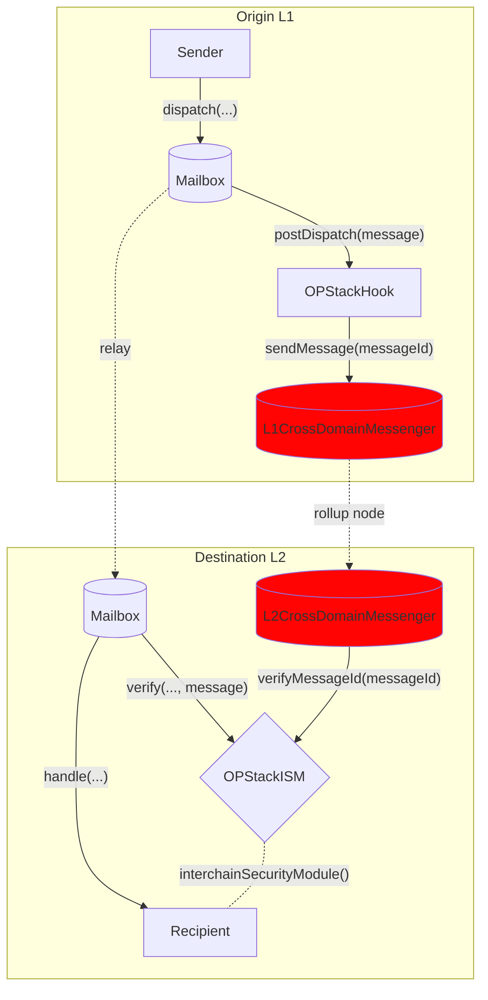

Optimism 和其他 [OP Stack](https://stack.optimism.io/) rollup 拥有自己的在 L1 和 L2 之间传递消息的接口，称为 `CrossDomainMessenger`。通过此接口传递的消息受益于 rollup [结算层](https://stack.optimism.io/docs/understand/landscape/#execution)的安全性。

```solidity
interface ICrossDomainMessenger {
    function sendMessage(
        address target,
        bytes calldata message,
        uint32 gasLimit
    ) external;
}
```

为了在 Hyperlane 中提供此安全性选项，我们创建了一个 Hook 和 ISM 组合，可以透明地配置以重用原生 OP Stack 接口。

有关 Hook 和 ISM 地址，请参阅[地址](/docs/reference/addresses/deployments/mainnet/mailbox)页面。

## 工作原理

OPStackHook 将 messageId 发送到 L1CrossDomainMessenger，后者将其注册为 Optimism `TransactionDeposited` 事件，包含 ETH 存款和消息数据，由 rollup 节点接收。
rollup 节点调用预编译合约 `L2CrossDomainMessenger` 的 relayMessage 函数，后者反过来调用配置的 OptimismISM 合约，将 messageId 在 verifiedMessageId 的映射中设置为原始 L1 发送者（即用户）。relayer 只携带消息而不带元数据，等待 Optimism 节点接收并对 Optimism 进行存储写入，然后验证消息传递。


