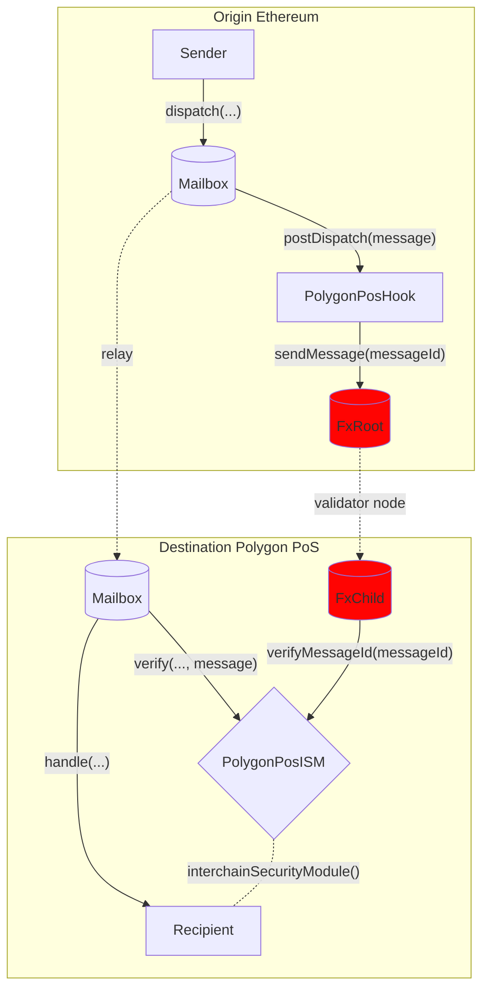

Polygon PoS 拥有自己的在 Ethereum 和 Polygon 之间传递消息的接口，称为 [`fx portal`](https://github.com/0xPolygon/fx-portal)。通过此接口传递的消息受益于 Polygon [状态同步机制](https://docs.polygon.technology/pos/architecture/bor/state-sync/)的安全性。

为了在 Hyperlane 中提供此安全性选项，我们创建了一个 Hook 和 ISM 组合，可以透明地配置以重用 fx-portal 接口。

有关 Hook 和 ISM 地址，请参阅[地址](/docs/reference/addresses/deployments/mainnet/mailbox)页面。

## 工作原理

Polygon FX-Portal 提供 FxChild (FxChild.sol) 和 FxRoot (FxRoot.sol) 作为桥接工作的主要合约。它调用并将数据传递给另一条链上的用户定义方法，无需映射。

FxChild/FxRoot 合约由 Polygon 团队提供和维护。您可以在 Polygon 的 [Fx-Portal 仓库](https://github.com/0xPolygon/fx-portal)中找到此合约的地址。
PolygonPosHook 使用 FxRoot 发送有效载荷。Validator 将接收消息并将其传递到另一条链。您可以在[文档](https://docs.polygon.technology/pos/how-to/bridging/l1-l2-communication/state-transfer/)中找到详细的状态同步机制。位于 `0x0000000000000000000000000000000000001001` 的 `StateReceiver` 被允许调用 FxChild 合约中的 `onStateReceive`。FxChild 调用抽象 `CrossChainEnabledPolygonChild` 中的 `processMessageFromRoot`，PolygonPosISM 实现了该抽象合约。`CrossChainEnabledPolygonChild` 由 [OpenZeppelin](https://docs.openzeppelin.com/contracts/4.x/api/crosschain#) 维护。

