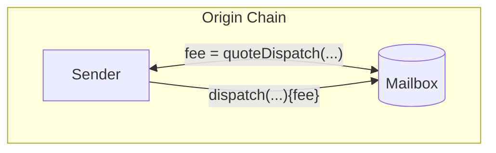
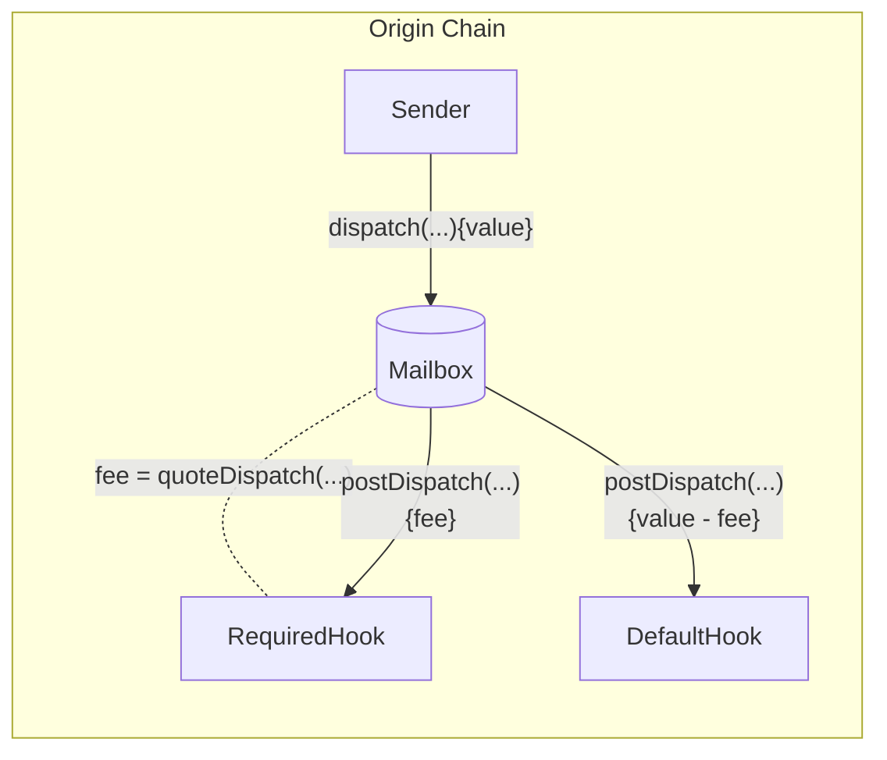

要发送跨链消息，开发者调用 `Mailbox.dispatch()`。

此函数接受消息内容、目标链 ID 和接收者地址作为参数。每条消息都作为叶子插入到由 `邮箱` 存储的[增量默克尔树](https://medium.com/@josephdelong/ethereum-2-0-deposit-merkle-tree-13ec8404ca4f)中。Hyperlane 的权益证明协议使用此默克尔树来验证欺诈证明。

## 调度

调用此函数将消息调度到目标域和接收者。

<Warning>
  Hyperlane 只能将消息传递给实现 `handle` 函数的智能合约。有关更多信息，请参见[接收消息](./receive)文档。
</Warning>

根据[调度后钩子配置](#post-dispatch-hook-config)，可能需要一些支付。有关更多信息，请参见 [`quoteDispatch`](#quote-dispatch) 部分。

### Solidity

```solidity
function dispatch(
    uint32 destinationDomain,
    bytes32 recipientAddress,
    bytes calldata messageBody
) external payable returns (bytes32 messageId);
```

<Info>
接收者地址左填充为 `bytes32`，以兼容地址不同的虚拟机。为方便起见，在 [`TypeCasts` 库](/docs/reference/developer-tools/libraries/typecasts)中提供了以下实用工具。

```solidity
function addressToBytes32(address _address) internal pure returns (bytes32) {
    return bytes32(uint256(uint160(_address)));
}
```

</Info>

### 示例

```solidity
// 从以太坊向 Polygon TestRecipient 发送消息
IMailbox mailbox = IMailbox("0xc005dc82818d67AF737725bD4bf75435d065D239");
bytes32 messageId = mailbox.dispatch{value: msg.value}(
  137,
  "0x000000000000000000000000f90cB82a76492614D07B82a7658917f3aC811Ac1",
  bytes("Hello World")
);
```

## 报价调度

费用通常配置为涵盖跨链 Gas 支付（IGP）以及协议成本。这些包括目标链上的交易提交、安全供应和维护。要获得相应 `dispatch` 调用的报价，您可以查询 `quoteDispatch` 函数。



### Solidity

```solidity
function quoteDispatch(
    uint32 destinationDomain,
    bytes32 recipientAddress,
    bytes calldata messageBody
) external view returns (uint256 fee);
```

引用的 `fee` 必须作为值传递给 `dispatch` 调用，以确保它不会回滚。

### 示例

```solidity
// 报价从以太坊向 Polygon TestRecipient 发送消息
IMailbox mailbox = IMailbox("0xc005dc82818d67AF737725bD4bf75435d065D239");
uint32 destination = 137;
bytes32 recipient = "0x000000000000000000000000f90cB82a76492614D07B82a7658917f3aC811Ac1";
bytes memory body = bytes("Hello World");
uint256 fee = mailbox.quoteDispatch(destination, recipient, body);
mailbox.dispatch{value: fee}(destination, recipient, body);
```

<Warning>
  向 `dispatch` 支付不足将回滚。如果您正在组合钩子，过量支付**可能不会**退还给消息发送者。
</Warning>

## 调度后钩子配置

邮箱上配置了两个钩子

- `required`：为所有涵盖必需费用的 `dispatch` 调用调用
- `default`：（除非被覆盖）在 `required` 钩子后使用剩余值调用



### 必需钩子

要查询必需钩子配置，您可以调用 `requiredHook` 函数。

```solidity
function requiredHook() external view returns (IPostDispatchHook);
```

### 默认钩子

要查询默认钩子配置，您可以调用 `defaultHook` 函数。

```solidity
function defaultHook() external view returns (IPostDispatchHook);
```

要在 `dispatch` 调用中使用自定义钩子覆盖默认钩子，请参见[钩子参考](/docs/reference/hooks/interchain-gas)。